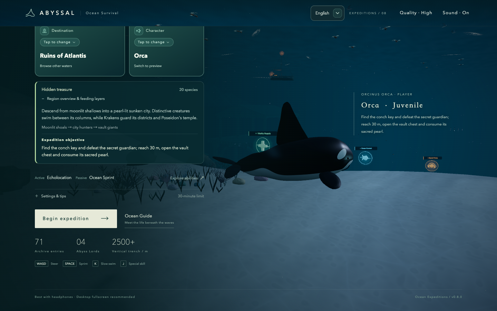

# ABYSSAL

A third-person ocean survival game for the browser. Choose an Orca or Giant Squid: feed, grow, escape hunters, and challenge the giants below. Explore Hawaii's coral shallows, moonlit Atlantis, the stormy Bermuda Triangle, and the layered Mariana Trench.

**[Play the published game](https://stanatny.github.io/abyssal/)** · [GitHub repository](https://github.com/stanatny/abyssal)

Published version: **v0.8.3 — Articulated Abyss Lords**. All four regions are playable, with regional ecology, music, hazards, Guide filters and completion objectives. Atlantis adds a conch-key treasure quest; Bermuda requires conquering its four Abyss Lords; Mariana starts at 15 m and opens its descent through four ordered guardians.

The v0.8.3 refinement extends Kraken's curling arms, redraws Hydra's articulated necks and tapered heads, and enriches Leviathan's armored sea-serpent silhouette. The same assets appear in the Ocean Guide and ocean encounters; bilingual notes explain the mythological inspiration. Gameplay thresholds and regional endings remain intact. These changes are included in v0.8.3; see [the model review](docs/lord_anatomy_revision.md).

Pause/results now offer reachable actions, regional guidance and keyboard/touch help across portrait, landscape, tablet and short desktop layouts. Paused scenes stop unnecessary drawing; Atlantis construction yields behind the loading screen. These changes preserve population, collision, near-city art and active-play quality. Measurements establish better warm-switch responsiveness and idle rendering, rather than a general FPS or phone-temperature improvement. GitHub Actions deploys `main` to the play URL above.



Play in a modern desktop or phone browser with WebGL 2 support—no account or download required. Select a character on the home screen and start an expedition. Music activates after the first interaction. Fish feeding uses short water-Foley intake, bite, and bubble tails, with three variants that avoid consecutive repetition. Adult male/female swimmers and divers use corresponding performed human recordings at their original pitch, gradually muffled later in the clip to suggest submersion. Prey-gathering transitions and blood clouds remain. Sound can be disabled at any time. Assets are CC0; see [audio sources](docs/audio_sources.md).

Starting an expedition smoothly rotates the home scene into the follow camera over about 1.65 seconds. The round timer and survival systems begin after control is handed over. You can pause and resume the transition; system reduced-motion preferences skip the camera travel.

## Unreleased Europa candidate

The current `feature/europa` review adds a fifth independent destination, **Europa**, beneath a solid ice ceiling. It is a fictional bonus expedition, directly selectable for now; future unlocking is unspecified. The published v0.8.3 version and the four-region reference sections below remain unchanged.

Explore five connected habitats: Ice Cradle, Brine Arches, Suspended Garden, Thermal Basin and Weaver's Hollow. Sixteen original ordinary alien species form a layered 247-organism food chain. Only the two playable characters come from Earth; this destination has no terrestrial wildlife, active crews, surface fleet or atmospheric breach. An abandoned original research lander is a static exploration artifact. The separate Alien Life Guide filter identifies fictional lifeforms and their actual feeding roles.

The alien roster now separates crystal-shelled shoals, articulated crawlers, radial blooms, broad gliders, eight-armed filterers, coiled-shell grazers, armored serpents and bell colonies. Their existing sizes, populations, food values and habitats remain intact.

Two original persistent Abyss Lords inhabit different layers: the **Lumen Stalker** guards the Thermal Basin with eight long unbranched arms, concentrated light organs and a telegraphed locked charge; the **Abyss Weaver** occupies the deepest Hollow with a three-lobed mantle, six bifurcating arms and a three-sector Tidal Loom. Reach 30 m and defeat either local lord with three separate flank bites to complete the expedition. Shared survival, skills and character-aware local records remain in use. The revised tonal score reduces ambient hiss and contrasts quiet exploration with a faster pursuit rhythm.

A crashed research lander at the Garden/Basin transition has a flooded, open-ended instrument gallery. Attached mineral clusters, restrained colonial glimmers and chemical plumes enrich the seafloor. Lumen Stalker now extends its eight arms into much longer returning coils, retaining its mantle and charge rules. The environment imagines possible water-rock chemistry; vents, life and luminous colonies on Europa are not established observations. See the [terrain follow-up](docs/europa_terrain_revision.md).

Read the [production brief](docs/europa_brief.md), [candidate verification](docs/europa_verification.md) and [music/model refinement](docs/europa_refinement.md) for implementation evidence and remaining review limits. This candidate is not a formal release.

## Gameplay review candidate (not yet published)

The current working candidate doubles base hunger consumption and adds stronger, size-dependent deep-water pressure. At 3 m, the full-depth drain is six times the same character’s shallow drain; this eases continuously to 1.5 times at 18 m and above. A HUD multiplier and both-language Guide explain the pressure. Survival timers follow actual active time even when rendering slows. Shallow feeding and large deep prey retain their existing populations and rewards.

A local **Fastest Expeditions** board keeps the ten quickest successful runs per region, including the explorer’s optional name, **Orca or Giant Squid**, and completion time. Records persist in the same browser; there is no online ranking or account. Pausing, loading and post-win exploration do not count. Mariana’s results offer a safe visit to the existing pineapple-house and waving-sponge Easter egg without changing the recorded result. Read [the gameplay review](docs/gameplay_balance_revision.md) for measurements and limits. The published link above remains v0.8.3 until release is authorized.

## cross-device interface review

Pause and results now have structured expedition statistics, the current regional task, device-appropriate help and reachable Continue/Dive Again and Return to Home buttons. Active-play headers hide the locked language selector, while tablet, short laptop and small landscape layouts separate radar, mission, alerts and touch controls. Destination and Guide selection keep the current row visible; the landscape Guide preserves independent browsing and detail areas. Both languages and characters retain the same gameplay. See [the review and verification limits](docs/ui_review_revision.md). This review is included in v0.8.0.

## responsive Atlantis loading and idle rendering

Pause and result screens retain their last ocean frame instead of continuously drawing; resize and quality changes refresh it. Active play keeps the existing frame rate and visual quality. Atlantis preparation now yields between safe construction units behind the existing loading screen, and the actor loop reuses temporary steering objects. Food, AI, collisions, Guide and regional objectives remain unchanged. The exploratory far-city LOD was removed because repeated GPU measurements did not establish a reliable gain; original city art and visibility are preserved. See [measurements, checks and device limits](docs/performance_preparation_revision.md). This preparation revision is included in v0.8.0.

## Bermuda Triangle

Bermuda adds an advanced storm-sea destination: an enterable 396 m ocean-liner wreck, an offshore drilling platform, moving cargo vessels, the Flying Dutchman with a Davy Jones captain and dangerous five-cannon volleys, seven damaging waterspouts and seven exclusive creatures. Four Abyss Lords occupy different depth bands, including Hydra near the surface. The nursery remains protected and food-rich. Rough waves, reef arches, an aircraft wreck, a cargo-ship graveyard and hydrothermal colonies distinguish its surroundings. Initial preparation and destination changes use a staged full-screen loading view. Bermuda has a distinct eerie exploration/chase/guardian score and bilingual landmark/hazard Guide cards. See the [production contract](docs/bermuda_brief.md) and [verification](docs/bermuda_verification.md). This destination is included in v0.8.0.

## Mariana Trench

The fourth destination is a compact vertical expedition: **420 × 760 world units**, descending to an **11,120 m displayed depth limit**, 3.75 times the other regions' depth. A safe Pacific shelf leads through folded basalt walls, natural side arches, bioluminescent wayfinding and four sealed terraces. Both characters start at **15 m** in this region. The offshore surface Hydra is the first mandatory guardian: defeating it opens the 2,600 m seal. Kraken, Gran Maja and Leviathan then unlock the 4,000 / 5,500 / 8,600 m passages. Hydra remains away from the safe shelf; radar first points to its surface territory before guiding the descent. Each guardian still requires the shared 25 m eligibility and three separate flank bites. Defeated gatekeepers stay defeated for the round; opened passages allow return travel.

Mariana has a regional completion requirement: **reach 30 m, defeat all four gatekeepers and reach the bottom refuge**. The four-region revision below supersedes the earlier shared ending for Atlantis and Bermuda. A warm, original procedural SpongeBob/pineapple-house Easter egg waits at the floor. It is decorative, not food. The map mixes real small deep-sea animals with explicitly fictional extreme-depth habitats for large Ancient Giants.

Seven exclusive species—Moorish idol, lanternfish, barreleye, deep-sea dragonfish, Mariana snailfish, goblin shark and Shonisaurus—join a 333-creature, 22-kind regional population. Sixteen additional 11–20 m animals feed the faster 15-to-25 m opening, using unchanged shared nutrition and normal respawns; deeper anchored giants provide adult food. The region has its own suspended-glass exploration score, depth arrangement and immediate pursuit/guardian rhythm. Read the [map brief](docs/mariana_brief.md) and [verification](docs/mariana_verification.md). Both destinations are included in v0.8.0.

Mariana's surface has a cool Pacific survey identity: an original research ship, a survey tender, instrument buoys, long swells, layered clouds and distant volcanic islands. Attached cup sponges, anemones, brittle stars and encrusting colonies cover the descent slope and trench walls, with restrained living glimmers. These decorative communities are artistically adapted, not a literal hadal survey. All four regions now identify their existing impassable horizontal limits with current bands in open water and a highlighted radar edge with a turn-back warning. See the [visual follow-up contract](docs/mariana_visual_polish.md).

## four destinations, four endings

The regional roster audit covers actual food and threat populations alongside the Ocean Guide. Hawaii adds a slow, independently modeled **Archelon**; Mariana adds a barrel-bodied **Shonisaurus** across its feeding layers. Bermuda gains 11–12 m pliosaurs and plesiosaurs between medium prey and its larger giants. Every destination has at least three ordinary kinds in each shoal, modern-hunter and ancient category, with regional exclusives in each. Shared creatures remain intentional.

| Destination       | Ordinary kinds / animals | Completion                                                                                                          |
| ----------------- | ------------------------ | ------------------------------------------------------------------------------------------------------------------- |
| Hawaiian Waters   | 28 / 313                 | Reach 30 m and defeat any one selected Abyss Lord                                                                   |
| Ruins of Atlantis | 20 / 412                 | Find the conch key, defeat the secret Kraken guardian, reach 30 m and consume the pearl from Poseidon’s vault chest |
| Bermuda Triangle  | 24 / 341                 | Defeat all four local Abyss Lords                                                                                   |
| Mariana Trench    | 22 / 333                 | Reach 30 m, defeat all four ordered gatekeepers and arrive at the bottom refuge                                     |

All selected lords stay defeated for the round; ordinary prey still respawn in their habitats. Lord attacks retain the shared 25 m eligibility and three separate flank bites. Atlantis's normal food and decorative house chests cannot complete its quest. Optional conch inscriptions reveal the key building on radar. Key and guardian can be found in either order; returning home resets both selections. Each destination now shows its identity, difficulty, food progression and objective in selection and Guide; phones can expand the longer overview. See [the implementation and verification record](docs/four_regions_revision.md). These regional objectives are included in v0.8.0.

## Atlantis puzzle and living wildlife

Atlantis hides one **conch key** in an adult-accessible public gallery each round. An optional conch inscription names its building and adds radar guidance. Collect the key and defeat the secret guardian in either order to open Poseidon's decorated vault chest; consume its pearl at 30 m to win. Ordinary house chests remain scenery. No quest object adds nutrition or growth.

The four regions add **Moon Jellies** and **Spiny Lobsters**, with bell pulsing, trailing oral arms, independent walking legs and real floor-following habitats. Hawaii/Mariana gain **White-tailed Tropicbirds**, while Atlantis/Bermuda gain **Brown Pelicans**. The surface keeps 28 birds in total per map; forward flight and wingbeats replace slow sideways gull orbiting. Shared mixed habitats and some sizes are qualified game adaptations.

Existing submarines now retaliate against nearby characters of at least 8 m outside the nursery: a **2.2-second warning** precedes a straight-running torpedo, with a **14-second launch cooldown**, **5-second lifetime** and **20 damage**. Dodge sideways or use solid cover. Hull destruction still needs three separate high-speed rams at 18 m. Mines are separate hazards. See [the revision and evidence](docs/living_ocean_revision.md). These quest, wildlife and vehicle changes are included in v0.8.0.

## Living lords and softer Atlantis pearls

The [v0.8.2 refinement](docs/lord_life_revision.md) lowers Atlantis shell-light and sacred-pearl glare. Lords patrol slowly inside their territories while undisturbed, turn around solid cover and return to patrol without a position snap. Their real lengths increase to 48 / 55 / 53 / 63 m (Kraken / Gran Maja / Hydra / Leviathan), with moderately larger territorial radii. Fixed anchors are adjusted to preserve open combat space and guardian separation. The shared 25 m attack gate, three flank hits, abilities and regional endings remain; ordinary prey populations do not change. These changes are included in v0.8.2.

## Languages

The game supports Simplified Chinese (`zh-CN`) and English (`en`) across menus, HUD, Ocean Guide, notifications, and results. Select a language at the top right of the home screen. Language is locked during an expedition, including pause and results. Pause offers Continue and Return to Home; returning ends the current round and lets you choose a language, region, and character before departing again. The first visit follows the browser language; an explicit choice is saved in local storage for later visits.

Implementation and copy-authoring guidance are in [localization](docs/localization.md). The [verification record](docs/verification.md) documents current release checks and historical bilingual coverage.

## Survive first, then rule the depths

Start as a **3-meter juvenile** in Hawaii, Atlantis and Bermuda, or at **15 meters in Mariana**. Eat smaller creatures, and avoid larger hunters. Follow the selected destination's objective above: Hawaii uses growth and a lord defeat, Atlantis uses a hidden treasure, Bermuda uses conquest of all four lords, and Mariana uses its gated descent. A round lasts at most 30 minutes of active play; paused time does not count.

- **Safe shallows:** Dense small-fish schools surround spawn. Hunters cannot enter or follow you in from offshore. Grow to about 4 meters before exploring the outer reef. Hawaii has one hammerhead and one white shark in separate outer-reef territories; Atlantis has one blue shark. The full hunter ecosystem lies farther down.
- **Food and survival:** Feeding replenishes hunger, repairs health first, then spends the remaining benefit on growth. Small prey yield progressively less nutrition and growth as you get larger. In the working candidate, a full hunger bar lasts about 3.8 minutes for a 3-meter juvenile in the shallows; a 25-meter character has about 39 seconds in the deepest water. These are no-food budgets, not predicted lifetimes. Published v0.8.3 has the earlier, gentler curve.
- **A gradual descent:** In the working candidate, hunger drain rises smoothly below 180 meters of displayed depth, reaching its size-dependent cap at 2000 meters. Juveniles experience much stronger pressure than acclimated adults. Medium schools lead from the nursery edge toward the outer shelf; more octopuses, Dunkleosteus, and Ancient Giants fill the next feeding stages. Larger shallow-water schools stay within their own depth bands. Feed before a deep excursion or lord fight, and return shallower to recover. See the [survival balance notes](docs/survival_balance.md).
- **Sprint and escape:** Sprint drains stamina; releasing it allows recovery. Empty stamina does not directly damage health, but empty hunger does. Use reefs, rock columns, and hulls to break pursuit. Solid terrain cannot be crossed directly.
- **Surface and deep water:** Build momentum by sprinting underwater, then cross upward through the surface to breach and catch gulls. Ruins, volcanoes, submarines, and spherical contact mines await below.
- **Lord battles:** Hawaii selects two lords each round. Atlantis has three Krakens guarding separate western, central, and rear-city territories. Hawaii requires any one local defeat at 30 m; Atlantis requires a hidden conch key and the true guardian’s mark to open its pearl chest. Bermuda requires all four lords, while Mariana requires all four ordered guardians and the bottom refuge at 30 m. You must reach 25 meters to damage them, attack inward from a flank, leave contact, and approach again. Three effective attacks are required; they cannot be swallowed whole. Each damaging bite restores up to 8 hunger (capped at 100), without healing or growth; defeat rewards are separate.
- **Find the nursery again:** Persistent radar shows location, heading, shallow/deep zones, and the direction of spawn. Pursuit and lord encounters change the music, while ability warnings signal danger.

## Choose your character

Each character has one active and one automatic passive ability. Both active abilities begin a **60-second cooldown on activation**.

| Character   | Active                                                                                                                                                                            | Passive                                                                                      |
| ----------- | --------------------------------------------------------------------------------------------------------------------------------------------------------------------------------- | -------------------------------------------------------------------------------------------- |
| Orca        | **Echolocation:** Detect nearby creatures for 20 seconds. Radar shows echoes; forward labels reveal creatures through fog or obstacles, including length and feeding eligibility. | **Ocean Sprint:** Ordinary sprint is 30% faster than Giant Squid: 41.6 versus 32 m/s.        |
| Giant Squid | **Ink Jet:** Underwater ink disorients nearby pursuing hunters and engaged lords, stopping them for 10 seconds, while the squid briefly jets along its activation heading.        | **Flexible Turning:** Faster yaw and pitch when not sprinting make direction changes easier. |

Sonar labels appear only ahead; turning reveals other creatures. Schools share labels to avoid screen clutter. Terrain and hulls block the squid's jet, and ink does not grant invulnerability.

Orca and Giant Squid share juvenile feeding eligibility and close-contact tolerance, including contact with small fish crossed during sprint. Orca propels itself through vertical stalk/fluke motion with pectoral-assisted turning. Squid defaults to mantle-tip-leading swimming with trailing arms, using fin waves, mantle contraction, and segmented arms; it streamlines during sprint and gathers its arms when feeding. Squid capture occurs in the visible arm region, and swallowing draws prey toward each character's actual mouth. Motion follows actual speed and swimming state. This is the game's default posture; real Giant Squid can move in both directions. See the source qualifications in the [v0.6.10 record](docs/feedback_v0_6_10.md).

## Controls

The character continually swims along its heading. Releasing keys or joystick preserves that heading rather than automatically leveling. Both characters can pitch up/down to 85° underwater. A steep nose-down collision with the seabed or a solid floor briefly eases the heading back to level, so the character can swim away; upward and sideways input stay responsive. Open-water diving, walls and ceilings do not activate this aid. Ordinary swimming at the surface eases upward pitch to about 20°; legitimate momentum-driven breaching is unaffected. A pitch gauge sits beside the radar. Eligible contact automatically feeds or attacks; **there is no bite key**.

| Action                         | Desktop keyboard             | Phone touch                                             |
| ------------------------------ | ---------------------------- | ------------------------------------------------------- |
| Rise / dive, turn left / right | W / S, A / D                 | Left joystick                                           |
| Sprint                         | Hold Space                   | Hold Sprint                                             |
| Character active ability       | J                            | Tap the ability button; countdown shown during cooldown |
| Slow swim                      | Hold K                       | —                                                       |
| Pause / resume                 | Esc, P, or on-screen control | Pause button                                            |

Desktop swimming is keyboard-only; the mouse operates menus and the guide. The phone game area prevents long-press text selection and menus, while guide search remains editable. **Invert vertical controls** under the home screen's expedition settings makes W / joystick up dive and S / joystick down rise, preserving the choice across refreshes. Sound, quality, and ordinary creature labels have interface settings. Marker preferences live on the home screen; sonar temporarily forces forward detection labels.

## What's in the ocean?

Choose **Hawaii**, **Atlantis Ruins**, **Bermuda Triangle**, or **Mariana Trench**. Each destination has its own environment, surface fleet, population, music, and lord encounters. Region changes display a loading screen while the destination prepares.

| Destination      | Ordinary species | Ordinary population | Lord encounters                                        |
| ---------------- | ---------------- | ------------------- | ------------------------------------------------------ |
| Hawaii           | 28               | 313                 | Two different lords selected each round                |
| Atlantis Ruins   | 20               | 412                 | Three Krakens in separate city territories             |
| Bermuda Triangle | 24               | 341                 | Four fixed lords across surface and deeper territories |
| Mariana Trench   | 22               | 333                 | Four mandatory ordered gatekeepers                     |

| Category             | Current content                                                                                                                              |
| -------------------- | -------------------------------------------------------------------------------------------------------------------------------------------- |
| Shallows and schools | Regional schools, flying fish, turtles, sunfish, slow reef fish, Atlantic spadefish, seahorses, and cuttlefish                               |
| Ocean Predators      | Deep-sea anglerfish, hammerhead, Giant Pacific Octopus, great white shark, sperm whale, blue shark, and swordfish                            |
| Ancient Giants       | Dunkleosteus, pliosaur, plesiosaur, mosasaur, Basilosaurus, megalodon, Helicoprion, Archelon, Shonisaurus, and large ichthyosaur             |
| Abyss Lords          | Kraken, Gran Maja, Three-Headed Hydra, and Leviathan, using vortices, pulses, repeated breath attacks, and high-speed charges                |
| Human activity       | Adult swimmers, adult divers, submarines, and horned contact mines; submarines require three separate rams meeting size and speed thresholds |

The home-screen **Ocean Guide** contains **71 character, creature, human-activity, quest and landmark/hazard entries** in v0.8.0, including **49 ordinary marine kinds**, plus a separate rewards section. It groups small prey and surface animals and invertebrates before modern predators, Ancient Giants, and Abyss Lords, with entries ordered by length within each group; playable characters and human activity have separate groups. Independent filters show the current expedition, Hawaii, Atlantis, Bermuda, Mariana, or all regions without changing the selected expedition; each creature identifies its regions. It follows system light/dark appearance and responds to changes while open. Swimmer/diver details offer male/female model previews. **Giant Squid is playable only**; wild Giant Pacific Octopus and Common Cuttlefish use separate models and guide entries.

These regions mix modern animals, Ancient Giants, and fantasy lords; it is not a reconstruction of real Hawaiian ecology. Lengths, depths, and speeds use game scale. Body length, wingspan, and tentacle length do not imply equivalent mass. See [ecological references and design choices](docs/ecology_sources_v0_5.md).

## Cross-region encounters

**Giant Ichthyotitan** is a rare 28 m Ancient Giant, with two individuals in each region's open deep-water routes. At 20–25 m it remains a dangerous predator: its warning precedes a committed charge, so dodge sideways before sprinting away. Actual length must exceed 28 m before feeding on it. The 28 m size, revived habitat and predatory behavior are game adaptations; the fossil-based estimate and uncertain body reconstruction are explained in the guide and [balance notes](docs/late_game_balance.md).

**Gran Maja** replaces the former Maya Beast's appearance with a broad silver-gray triangular head, six blue forehead eyes, dense teeth in red gums and a long serpentine body with heavy ring folds. Its existing pulse abilities, territory and contact area are preserved independently of the new artwork. Every Abyss Lord now requires **three separate valid flank bites**, with disengagement and cooldown between hits. All destinations retain the 25 m attack threshold. Completion is regional: Hawaii requires 30 m and any one local lord; Atlantis requires 30 m and its secret-guardian pearl; Bermuda requires all four local lords; Mariana requires 30 m, all four ordered gatekeepers and the bottom refuge.

At **18 m** and an impact speed of at least **20 m/s**, both characters can ram hulls: small surface boats take one hit, large surface ships and submarines take three separate hits. Leave the hull before another ram. Broken surface ships capsize and sink, stop blocking travel and grant no passenger loot; submarines still release three adult divers once. The 18 m gate replaces the previously published 8 m submarine gate.

The desktop follow-camera offset is 10% shorter, while touch controls retain their existing camera rig. Hawaii's deep floor has matte rock grain, strata and shallow mineral rubble instead of broad artificial ground glow. Rooted, feathered sea pens provide restrained light from their tiny polyps; volcanic lava and the existing two nearby environmental light slots remain. This scenery does not change feeding stocks, terrain heights or solid contacts. See [the camera and seabed review](docs/hawaii_seabed_review.md).

See [the integration verification record](docs/global_ocean_polish.md) for evidence and limits, and [release verification](docs/verification.md) for the main-branch checks.

## Atlantis expedition

A moonlit archipelago replaces Hawaii's daytime resort surface. The city extends through five districts: Moon Harbor, Drowned Agora, Sacred Avenue, Poseidon Acropolis, and Starless Necropolis. Streets, plazas, courtyards, colonnades, domed buildings, towers, and temples fill a district footprint of approximately **69.64% of the horizontal sea area**, including open space. The central avenue and royal arena stay open for travel and combat beneath the Poseidon monument. Glowing pearls in sculpted marine shells mark streets and the arena perimeter. Three raised sanctuary/bridge complexes provide lower galleries, upper halls, and an open vertical well, with usable passages below the decks. City lighting keeps nearby masonry readable while the outskirts retain dark seabed, broken relics, and sparse cold bioluminescence.

The [v0.8.1 lighting refinement](docs/atlantis_light_review.md) removes bright rectangular wall-inlay emission and smoothly fades distant pearl/inscription emission. Nearby shell-based lighting and the city's complete architecture remain intact. This material change preserves gameplay and does not establish a performance or device-temperature improvement.

Atlantis has a dedicated mysterious exploration score, with chase and lord arrangements responding to encounters. Three independently controlled Krakens guard the western district, central court, and rear city; the shared 25-meter attack gate, repeated flank contacts and retreat windows apply. One of these three is secretly assigned as the treasure guardian each round. Its defeat unlocks the sacred pearl beneath Poseidon’s temple, which must be consumed at 30 meters to win. See [regional music](docs/atlantis_music.md) for audio details and listening-review limits.

The home-screen destination and character cards put their change buttons on a dedicated row so their titles and selected values align in both languages and on narrow screens.

| New species            | Stage                            | Distinctive anatomy                                                |
| ---------------------- | -------------------------------- | ------------------------------------------------------------------ |
| Atlantic spadefish     | Safe shallow schools             | Tall silver body, dark bars, extended dorsal/anal rays             |
| Short-snouted seahorse | Slow scattered shallow residents | Compressed plated trunk, short snout, curled tail, fluttering fins |
| Common cuttlefish      | Slow scattered shallow residents | Broad mantle, rippling fin skirt, short arm crown                  |
| Blue shark             | Modern offshore predator         | Slender blue body, long pectoral fins, pointed snout               |
| Swordfish              | Modern offshore predator         | Slender body, flattened bill, swept dorsal, crescent tail          |
| Helicoprion            | Ancient medium-water predator    | Fixed tooth whorl within the lower jaw                             |
| Large ichthyosaur      | Ancient deeper-water predator    | Long toothed jaws, large eyes, four flippers, vertical tail        |

Atlantis has 392 ordinary creatures across 18 species, including shared sardines, sunfish, tuna, rays, octopuses, and selected Ancient Giants. There are 152 genuinely schooling juvenile prey plus 16 small loose residents; tiny seahorses are scenery-rich supplements, not a substitute for nutritious schools. Seahorses and Common Cuttlefish keep separate small home areas along the shallow route ahead of spawn; their natural small scale rewards close observation, and consumed residents return to their own habitat. Ten additional small city shoals weave through streets and galleries; additional sunfish, tuna, rays, and Ancient Giants provide successive feeding layers and adult nutrition. These deep-city habitats are a fantasy adaptation described separately in the guide. Hawaii now has 293 ordinary creatures, including six Archelon; each map adds just two rare Ichthyotitan individuals while preserving all previous nursery and food stocks. City travel also includes a visible destination-loading layer and an immediate pursuit score when a hunter gives chase. See [city ecology](docs/atlantis_city_ecology.md) for population, nutrition, and respawn evidence. Consumed creatures use the existing respawn rules, and both maps share hunger, nutrition, healing/growth, rewards, abilities, and the 30-minute active-play limit.

The imagined city, revived extinct species, mixed real-world distributions, assigned depths, and active pursuit are game design. Size conventions and primary sources are documented in the [Atlantis ecology notes](docs/atlantis_ecology_sources.md). All seven regional models have distinct anatomy, materials, and motion; see the [creature revision record](docs/atlantis_creature_revision.md), [art production notes](docs/atlantis_art_notes.md), and [verification results and limits](docs/atlantis_verification.md). Natural whole-round pacing and physical-device performance remain unverified.

## Atlantis interiors and underground exploration

The expedition includes three real underground sites: the furnished halls beneath Moon Harbor, an open cistern/archive beneath Drowned Agora, and the ritual galleries and sacred vault beneath Poseidon's main temple. Each has connected upper/lower spaces, an adult turning area and two access routes. Enter the temple crypt through the opening in its central floor, or through the rear gateway. Its side galleries are passages; turn large characters in the central well or lower hall.

The Poseidon monument has been resculpted with a muscular silhouette, carved face and beard, articulated hands, draped cloth and a towering trident. The main temple has fluted columns, marine reliefs, ritual furnishings and shell-pearl illumination. Ordinary enterable villas and courtyard houses now contain carved furniture, decorated storage chests and matte clay pottery. These small houses remain spaces for juvenile characters; not every adult fits their doors. Ordinary chests and pottery are scenery and grant no loot. The sacred pearl in the lower Poseidon vault is a separate quest object unlocked by the secret guardian. Masonry seams, columns and entrances support coral, sea fans, sponges and anemones.

The existing eight-member spadefish schools inhabit the Harbor lower hall and Agora lower court. Eight sardines and three tuna have been redistributed from existing city schools to the Poseidon vault; overall regional stock and nutrition remain unchanged. Small crypt fish are exploration snacks, not enough to sustain a grown character's entire lord battle. Seek larger prey in the surrounding city.

This revision also corrects visible roof/collision mismatches and keeps independent regional residents near their home habitats. All three excavations use the same regional terrain registry, rendered floor, collision and lifecycle contracts. See [exploration verification](docs/atlantis_exploration_verification.md) for completed checks, performance measurements and remaining limits.

## Ocean rewards

The guide explains rewards, and active effects appear in the HUD after pickup. Repeating a timed reward refreshes its duration rather than stacking it. The shallows retain one pickup of each type; 18 further rewards are placed randomly each round, for 21 total. Collected rewards respawn in their current-round positions after 45 seconds.

| Reward          | Appearance         | Effect                                                                                                                                                                                                              |
| --------------- | ------------------ | ------------------------------------------------------------------------------------------------------------------------------------------------------------------------------------------------------------------- |
| Vitality Supply | Green cross        | Immediately restores 50 health, 50 stamina, and 50 hunger, each capped at 100, and clears exhaustion.                                                                                                               |
| Ocean Current   | Blue double arrows | Immediately refills stamina and clears exhaustion. Sprint costs no stamina for 30 seconds.                                                                                                                          |
| Abyssal Frenzy  | Orange fangs       | For 20 seconds, close-range feeding expands and nearby edible underwater prey are drawn toward your mouth. It does not enlarge your body or let you eat larger creatures; normal feeding still heals and grows you. |

Frenzy changes only capture reach and suction. It does not alter feeding eligibility, body size, or growth rewards. Rocks and hulls block suction; creatures at least as long as you, lords, submarines, and mines cannot be pulled in. Collecting it again refreshes its 20-second duration, and growth from normal meals remains after it expires.

## Local development

New or redrawn creatures, humans, environments, audio, and effects must meet the [asset quality standard](docs/asset_quality_standard.md), using current refined counterparts as the minimum reference. Below-standard work remains an explicitly labeled prototype rather than shipping as a new category. Start with [AGENTS.md](AGENTS.md).

For a new region or substantial map redraw, use the repository-local [map-production Skill](.agents/skills/abyssal-map-production/SKILL.md) and its [brief template](.agents/skills/abyssal-map-production/references/map_brief.md). These provide the Kimi art assignment and Codex integration/review contract, including ecology, regional audio, traversal, and performance. The current [Hawaii performance follow-up](docs/hawaii_performance.md) reuses static collision indexing without changing the map art or feeding rules.

The [Atlantis construction optimization](docs/atlantis_construction_optimization.md) reuses immutable host edges during furniture placement. Serial Mac measurements show a modest reduction in region-switch waiting while preserving the complete city layout, geometry, and collision data.

The project uses JavaScript, Three.js, and Vite. Models, animation, music, and most event effects are procedural; adult screams use bundled CC0 human recordings. Node.js 22.12+ and a WebGL 2 browser are recommended.

```bash
npm ci
npm run dev
```

The default development URL is `http://127.0.0.1:5178`. Common commands:

```bash
npm test          # Game rules and implementation unit tests
npm run check     # Source and documentation formatting
npm run build     # Build the static site into dist/
npm run preview   # Preview the built artifacts locally
```

Keep the development server running and execute `npm run test:browser` in another terminal for key browser flows. Browser scripts use locally installed Google Chrome; `ABYSSAL_DEV_URL` overrides the development URL. Run `node scripts/verify_i18n.mjs` for bilingual browser coverage; consult the [verification record](docs/verification.md) for execution results and limits. Targeted entry points, results, and limits are documented there. Screenshots, logs, and listening files go to Git-ignored `.local/`.

Project documentation is maintained in English. Existing Chinese source comments remain; new player-facing copy is maintained through `src/i18n.js` and `src/locales/` so both supported languages stay covered.

Pushing to `main` runs installation, unit tests, formatting, and build through [GitHub Actions](.github/workflows/pages.yml), then publishes `dist/` to [GitHub Pages](https://stanatny.github.io/abyssal/). Vite uses relative resource paths for repository-subpath deployment.

## Project status and next steps

**v0.8.2** adds continuous territorial lord patrols, larger lord bodies/territories and restrained pearl lighting. **v0.8.1** refines Atlantis decorative emission while preserving local marine lighting and city detail. **v0.8.0** delivers the four-region objectives, conch-key quest, wildlife, submarine retaliation and interface/preparation improvements described above. The preceding **v0.7.2** added cross-region encounters, camera/seabed refinement and Atlantis construction caching. The preceding **v0.7.1** added furnished Atlantis homes, marine scenery, three underground exploration sites and the resculpted Poseidon monument and temple. That release corrected roof contacts and regional residents' habitat persistence while preserving population totals and shared survival/combat rules. The preceding v0.7.0 introduced Atlantis, regional guide filters and shared collision indexing. The current Hawaii scenery retains its feeding population and terrain contacts. See [Hawaii performance](docs/hawaii_performance.md) and [Atlantis performance](docs/atlantis_performance.md) for measurements and their limits. The repository-local [map-production Skill](.agents/skills/abyssal-map-production/SKILL.md) documents the production and review process for future regions.

Release checks and earlier evidence are in [verification](docs/verification.md) and [Atlantis verification](docs/atlantis_verification.md). Deployment status is available in [GitHub Actions](https://github.com/stanatny/abyssal/actions/workflows/pages.yml). Candidate and local-only statements in older development records preserve their status at the time.

This is a single-player static web game: no accounts, online multiplayer, or cloud saves, and the current round is not saved. Browser local storage retains best length and preferences. Procedural models and ecology remain simplified. Natural full-round pacing, real-phone handling, and low-end performance need continued tuning; browser viewport emulation is not real-device acceptance.

- [v0.5 gameplay, characters, and combat](docs/feedback_v0_5.md)
- [v0.5.1 playable squid and wild octopus](docs/feedback_v0_5_1.md)
- [Actual verification records](docs/verification.md)
- [Next steps](docs/next_steps.md)
