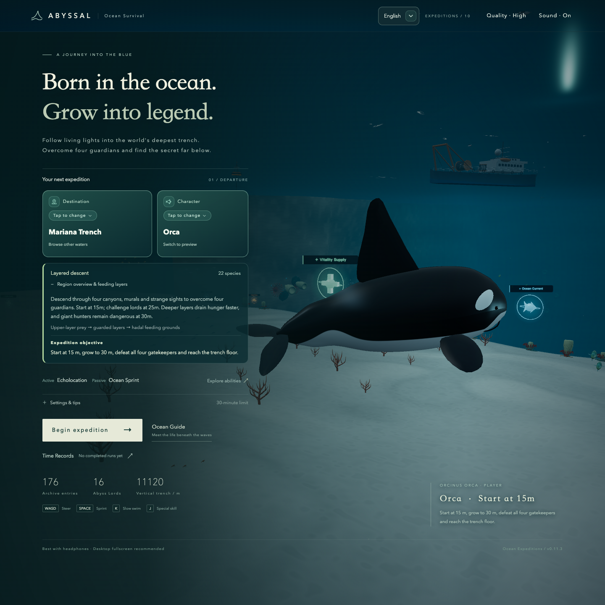

# ABYSSAL

A third-person ocean survival game for the browser. Choose an Orca, Giant Squid, Zombie Shark or Mechanical Shark: feed, grow, escape hunters, and challenge the giants below. Explore eight destinations: Hawaii, Atlantis, Bermuda, Mariana, the Amazon River, Europa's alien ice ocean, the airborne mythic Penglai Sanctuary and the underwater Odyssean Sea.

The current uncommitted review adds moving lord recovery: bounded circling, faster regrouping after a counter and one close-range, fully warned frontal guard. Side/back movement and depth changes remain safe counter routes; body openings, skill recovery lengths and the Sage’s five-hit pressure remain. See [the candidate review](docs/lord_contact_rare_blessing_revision.md).

An uncommitted [lord-contact and rare-blessing candidate](docs/lord_contact_rare_blessing_revision.md) follows the published release: a short rainbow capture celebration, body-blocking lord encounters, broader side/back weaknesses and any-angle body bites during post-attack recovery. After player feedback, each opening permits one damaging bite or torpedo; the next completed lord skill restores the chance to counter. The Sword Sage follow-up starts whole-map pursuit as soon as the Four Symbols fall:350 HP, five recovery counters, shorter2.2/2.6-second openings and a readable1.9-second warning. Other lords retain three hits; his bounded turns now correctly handle a player directly behind him. Rare captures fill health, stamina and hunger to150, including Frenzy, companions and torpedoes. Formal main/Pages stays v0.11.4 until the user accepts and authorizes publication.

**[Play the published game](https://stanatny.github.io/abyssal/)** · [GitHub repository](https://github.com/stanatny/abyssal)

Current main edition: **v0.11.4 — Exploration, Recovery and Runtime**. Mariana becomes an irregular deep pit with giant staggered rock shelves and winding routes. First crossing a rare habitat reveals its glowing rainbow minimap range at any depth; ordinary effort, Frenzy and Zombie Shark companions can capture its evasive resident. Nutritious meals add independently expiring 2-health/second recovery layers, capped at three, instead of instant healing. Height-aware collision queries reduce unnecessary work in stacked terrain. Fresh touch devices default to Smooth; explicit High/Smooth choices persist, and desktop default remains High. Eight destinations, four characters and existing regional endings remain. GitHub Actions publishes successful main builds; see [the release summary](docs/release_v0_11_4.md) and [verification](docs/verification.md). Physical-phone and M4 sustained thermal performance remains unmeasured.

The accepted terrain checkpoint `bd6850b`, included in this edition, reshapes Mariana into an irregular three-dimensional deep pit. A broken shallow lip, curved four-sided walls and depth-varying outlines surround the retained eight giant staggered rock shelves and winding passages. The actual lowest-floor sampler and radar contour follow the new terrain. Published gate, ecology and survival rules remain; see [the current production brief and review](docs/mariana_irregular_terrain.md). The prior layered expedition, Bermuda Leviathan habitat and spawn Frenzy remain included; see [v0.11.3](docs/release_v0_11_3.md).

The user accepted the combined `fix/mariana-layered-expedition` candidate and authorized committing and pushing it to main on 2026-10-09. Repository rules and the Map Production Skill now assign development to the current AI agent by default; another model requires the user's explicit specification. The canceled Kimi art worktree was not integrated. v0.11.2's accepted model and explorable-wreck improvements remain included.

The accepted Ocean Guide correction (`60a48ee`), [four-model anatomy and motion revision](docs/mythic_model_revision.md) (`b132a6f`) and [wreck exploration and interiors revision](docs/wreck_interior_revision.md) are included since v0.11.2. Linked review records preserve their original candidate measurements and status; their publication supersedes those candidate-only delivery labels.

The v0.8.3 refinement extends Kraken's curling arms, redraws Hydra's articulated necks and tapered heads, and enriches Leviathan's armored sea-serpent silhouette. The same assets appear in the Ocean Guide and ocean encounters; bilingual notes explain the mythological inspiration. Gameplay thresholds and regional endings remain intact. These changes are included in v0.8.3; see [the model review](docs/lord_anatomy_revision.md).

Pause/results now offer reachable actions, regional guidance and keyboard/touch help across portrait, landscape, tablet and short desktop layouts. Paused scenes stop unnecessary drawing; Atlantis construction yields behind the loading screen. These changes preserve population, collision, near-city art and active-play quality. Measurements establish better warm-switch responsiveness and idle rendering, rather than a general FPS or phone-temperature improvement. GitHub Actions deploys `main` to the play URL above.



Play in a modern desktop or phone browser with WebGL 2 support—no account or download required. Select a character on the home screen and start an expedition. Music activates after the first interaction. Fish feeding uses short water-Foley intake, bite, and bubble tails, with three variants that avoid consecutive repetition. Adult male/female swimmers and divers use corresponding performed human recordings at their original pitch, gradually muffled later in the clip to suggest submersion. Prey-gathering transitions and blood clouds remain. Sound can be disabled at any time. Assets are CC0; see [audio sources](docs/audio_sources.md).

Starting an expedition smoothly rotates the home scene into the follow camera over about 1.65 seconds. The round timer and survival systems begin after control is handed over. You can pause and resume the transition; system reduced-motion preferences skip the camera travel.

The [serpentine-motion and large-prey review](docs/serpentine_density_revision.md) adds traveling body waves and independent large-meal homes. The [Penglai ground-navigation review](docs/penglai_ground_navigation.md) prevents mountain penetration and trapped walkers with body-aware terrain and solid checks. Both are included in this edition.

The [tentacle and guardian review](docs/tentacle_combat_revision.md) gives octopus-like arms continuous movement and Kraken a central toothed maw. Kraken approaches its vortex, closes its arms and delivers a delayed heavy bite; outward sprint or solid cover interrupts the grip. The [distance-pressure follow-up](docs/kraken_distance_revision.md) makes escape harder nearer its actual animated mouth and progressively easier outward. Azure Dragon replaces its charge with warned water breath. Lord eligibility, three-hit settlement and regional objectives remain.

The [Europa combat review](docs/europa_lord_revision.md) gives Lumen Stalker three sequential locked arm lances and Abyss Weaver staggered vertical Tidal Loom bands. Both retain readable warnings, cover and recovery windows. Cameroceras, Pearl Nautilus, Spiral Grazer and Bell Carrier appendages also bend continuously. The [rare-eye and touch review](docs/rare_eye_touch_revision.md) restores visible eyes and places phone slow swim above skill and sprint.

The [Amazon crocodilian review](docs/amazon_crocodilian_revision.md) differentiates skulls, fitted eyes/teeth, muscular bodies, keeled armor and articulated feet across all five shared models. The final swimming correction keeps fast-swimming feet trailing outside the flanks and joins a gentle rear-body wave to the tail. Ecology, body lengths, food and combat values are unchanged. Linked review records retain the status and measurements at their original review; this release supersedes their candidate-only delivery status.

## Odyssean Sea

The western-mythology sea road adds twenty-one exclusive ordinary kinds, including Coral Mermaids, Hippocampi, Tide-crowned Naga and Ketos, with distinct anatomy and continuous swimming. Rose coral, Mediterranean seagrass, broken fluted gateways, amphora fields and an enterable 90 m ancient galley lead from safe Ithacan shallows through three spaced guardian territories. Independent 18–24 m meals support late recovery without turning the largest predators into dense schools.

**Karkinos** guards the broken-mast shelf with eight terrain-fitted jointed legs, unequal giant claws, an inner frontal sweep and two longer pinch sectors and three bottom-hugging pressure lanes. **Scylla** guards the middle strait with six independently moving necks, toothed heads, twelve fin-feet and six staggered mouth-launched water lances. **Charybdis** guards the deeper basin with a bounded frontal intake and a locked travelling tidewall, without Kraken arms or grip. Each has marked escape space, solid-cover checks and a 4–4.5 second recovery window. At 25 m, three separate valid hits can defeat each; complete the sea road at 30 m after defeating all three once-only guardians.

All four playable characters start at 3 m, and the exclusive Golden Argonaut follows the existing evasive rare/150-cap rules. The Guide includes independent bilingual stories and separate skill cards. The preceding refinement reduced ordinary stock from 319 to 266. The current follow-up expands to 21 distinct ordinary kinds with 269 individuals, retains late recovery meals, seats Karkinos on sloping terrain and adds flowing serpent/mermaid motion. Gran Maja’s shared model also gains a stronger travelling body wave, with its accepted head, size, skills and contact geometry preserved. See [the current anatomy and roster review](docs/odyssey_roster_revision.md) and [the preceding refinement](docs/odyssey_refinement.md). Lyre-like exploration music transitions to a faster pursuit pulse and a deeper guardian layer. This reviewed art/motion checkpoint `01da839` is included in v0.11.0; see [the brief](docs/odyssey_brief.md) and [verification and limits](docs/odyssey_verification.md).

## Recovery and graphics

Without food effects, fed players recover 0.5 health/second. Each nutritious meal adds one independent 2-health/second layer for 2.5–10 active seconds; up to three give 2/4/6 per second. HUD shows the available rate and three depleting indicators. Mouth feeding, torpedo kills, companions and lord nutrition share the rule. Medical supplies and rare blessings retain their special effects. See [the recovery review](docs/health_recovery_revision.md).

The [runtime review](docs/runtime_performance_followup.md) retains exact collision, populations, AI frequency, gameplay clocks and High art/effects. On the M6 test host, three paired Mariana High samples reduce main-loop CPU about 38%, without establishing a general FPS, GPU or physical-device heat improvement. Smooth reuses the existing lower-resolution/effect preset; users can switch settings at any time.

## Living ecosystems and mythic forms

The accepted ecosystem/rare/Guide checkpoint `4691135` and its reviewed follow-up are included in v0.10.1. The follow-up gives nine shallow marine kinds and four mythic fish distinct anatomical silhouettes, rebuilds the giant Kun and integrates actual Kun/Peng and Dragon-Gate carp/Cloud Dragon transformations without adding individuals. Cloud Dragon is an ordinary threat below 25 m, separate from the monastery guardians. The Guide adds both alternate forms, opens without automatic search focus on phones, presents playable active/passive skills separately and tells backgrounds directly. Read [the silhouette, transformation and Guide review](docs/silhouette_transformation_revision.md) for references, verification and limits.

Creature abilities now use independent Guide cards as well: the Sword Sage’s Myriad Blades Converge and Skyborne Sword Rush each show their own effect, response and recovery timing. Registered hunter attacks, guardian techniques, automatic transformations and rare blessings follow the same layout; ordinary swimming habits remain separate. This changes presentation only and preserves battle values.

The Guide hides empty categories for a selected destination, includes individual story paragraphs for 85 original/legendary living kinds across eight maps, including the alternate forms, and puts shared survival rules in the expandable regional introduction. Penglai uses named martial techniques consistently in its Guide and battle warnings. Exclusive rares have restrained glints and a depth-occluded emblem, fading at distance without additional scene lights. These changes preserve combat and ecology values.

The published [first-crossing rare-discovery revision](docs/regional_rare_habitat_crossing.md) reveals the selected habitat's glowing rainbow minimap ring only when the player first swims through that circle's horizontal area, at any depth. A brief Rare area found notice announces discovery; the known circle then remains until capture or a new round, with heading-relative/layer clues and nearby emphasis. Rares exist from the start and an initial 3 m character can capture them without a 30 m requirement. This supersedes the early 500/3D reveal, preserves rare ecology/rewards and is included in this edition. [Distinct glowing rainbow rare identifiers](docs/regional_rare_iridescent.md) differentiate the target label, sonar/minimap contacts, habitat range and world diamond from cyan food, yellow counterattack warnings, red danger and purple/pink lord markers.

The ecosystem refinement adds one exclusive rare per destination, separate from ordinary food stocks. Each expedition randomly chooses a secluded habitat; clues narrow the search rather than reveal a fixed spawn. Rares cruise/escape at 14/18 m/s with gentler dodges; short sprints can close the gap. Frenzy suction works at close unobstructed range. Zombie Shark companions speed up to 26 m/s for rares and can hunt them from a legal 5 m summon; ordinary prey still use the owner-minus-5-m limit. See [the current capture review](docs/regional_rare_capture.md). A confirmed capture fills health, stamina and hunger and raises all three limits to 150 for that round; a new round restores 100. There is no rare respawn or growth bonus. Their own Guide category is visible; collection locking is deferred.

This edition also adds individual bilingual natural-history, fossil and lore introductions, corrects Amazon snake/crocodile swimming, and refines Europa creature anatomy. It does not imply that every accepted creature was redrawn. Read [the review](docs/ecosystem_polish.md) for the audited roster, verification and limits. The linked reports retain their original review measurements; current publication checks are recorded in the release verification document.

The crocodilian swimming follow-up corrects feet folding into the body and connects a gentle rear-body wave to the moving tail. Fast-swimming feet now trail along the flanks, while the head and shoulders remain steady. All five shared crocodilian models use this pose; river navigation, food and combat rules retain their existing behavior. This is included in v0.10.2; see [the motion review](docs/amazon_crocodilian_revision.md#current-swimming-posture-correction).

## Deep exploration review

The accepted development checkpoint on `feature/deep-exploration` follows Bermuda's real wave height while floating, adds directed side/rear retaliation from edible near-sized predators, and introduces small telegraphed deep thermal surges with safe bypasses. Mariana's rectangular terraces become irregular layered rock passages, with richer attached wall ecology and Hydra in the first deep canyon. Existing hunger, feeding values and regional endings remain intact. Read [the review and verification limits](docs/deep_exploration_revision.md). These changes are included in v0.9.0.

The current marker follow-up distinguishes **yellow edible retaliating predators** from **red dangerous hunters** in target hints, sonar labels and radar echoes. Harmless edible prey retain green identification. Both-language Guide tips explain the distinction; combat rules are unchanged. See [the focused review](docs/retaliation_marker_revision.md). This follow-up is included in v0.9.0.

## Amazon River

The sixth destination adds **Amazon River**, immediately before Europa in the destination selector. Two connected, winding river arms surround a rainforest island with an eroded underwater root vault. Explore a water-lily nursery, submerged-root bends, a flooded forest and two deeper sovereign pools. Dive below the surface cap to cross between the arms; three cross-channel routes appear on the radar. The outer banks remain solid. The displayed depth and saltwater protagonists in freshwater are deliberate fantasy adaptations.

Twenty ordinary freshwater species use their own models and habitat-aware replenishment: tetras, discus, hatchetfish, armored catfish, pacu, arowana, arapaima, redtail catfish, river turtles, piranhas, electric eels, stingrays, caimans and anacondas, plus revived Titanoboa, Purussaurus and Stupendemys and two explicitly fictional giants. Saltwater Crocodile is labeled as an introduced fantasy animal, rather than an Amazon native. This ecosystem does not import marine schools, human vessels, submarines or terrestrial crews.

Two exclusive persistent Abyss Lords, **Yacumama** and **Rootjaw Sovereign**, guard separate pools. Reach 30 m and defeat both to complete the expedition; each retains the real 25 m eligibility gate and three separate valid hits. The four existing characters, ordinary growth, survival, healing-first meal rewards, skills and local completion records remain shared. River paths appear on the radar; bilingual region descriptions and the Guide use the actual regional registry. An independent wood/reed exploration score changes to immediate rhythmic pursuit and guardian layers.

Read [the production brief](docs/amazon_brief.md), [sources and fantasy boundaries](docs/amazon_sources.md), and [current refinement and verification](docs/amazon_refinement.md). The [first-pass record](docs/amazon_verification.md) is historical. The accepted redraw and root-vault routes are included in v0.9.0.

## Penglai Sanctuary

Penglai is an independent Chinese-mythology interpretation: shallow lotus waters connect to misty mountain airspace, extensive peach woodland, green rock shoulders, pine and bamboo, pavilions, a Dragon Gate and a double-roofed Taoist monastery. All four protagonists start at **15 m** and may swim and fly continuously here; the other seven destinations retain their own surface rules. Mountains, pillars and roofs remain solid. Sky altitude and remaining guardian directions appear in the HUD/radar.

Eighteen original ordinary mythic kinds form the actual replenishing ecosystem: jade minnows, lotus sprites, Wenyao and Luo wingfish, Chiru, Xuangui, two carps, Lushu, cloud cranes, Bifang, nine-tailed foxes, Hujiao, Gudiao, Zheng, Bashe, Kui and Kun. Cranes sustain moving, wing-spaced V formations with separated flight lanes; ground beasts follow their actual foot clearance and warn before leaping. They turn on a level plane, hold their launch heading through each leap and animate strides from actual travel; idle or blocked animals do not keep running in place. Serpentine Chinese dragons have legs, antlers, whiskers and mane. The Four Symbols occupy their cardinal habitats: eastern mountain, western ground court, southern airspace and northern lotus pool. Water is opaque when viewed from above. No Earth/alien wildlife, human crews or ships enter this destination. The models and original pentatonic music are game interpretations, not historical reconstructions.

At 25 m, defeat the four persistent guardians around the monastery: Azure Dragon in the east, White Tiger in the west, Vermilion Bird in the south and Black Tortoise entwined with a serpent in the north. Only then does the Sword Sage's ward dissolve. Defeating the sage completes this expedition; no extra 30 m gate is required. The monastery has a transparent, physically solid Four-Symbol ward: each guardian defeat dims its corresponding sector and updates the remaining names; only the fourth removes the barrier. The Sword Sage has a complete clothed pelvis and legs, with both feet planted on one broad forward-pointing greatsword. He alternates three terrain-blocked remote swords with a short straight sword dash, each preceded by a 2.2-second warning. The dash leaves a four-second counterattack window. After the unlocked territory is first entered, the sage continues a slow pursuit beyond his home radius; sprint can gain distance. Other guardians stay territorial. Contact, torpedoes and the Zombie Shark companion retain shared costs and meal settlement, with regional air accessibility.

Six collidable floating mountain islands with peach trees surround the monastery, whose original brush-style entrance plaque reads **以气御剑**. The two wingfish have distinct body plans: Wenyao is a broad feathered carp, while Luo is a slender bronze flyer with swept wings and paired ribbon tails. White Tiger has the fastest pursuit/leap, Vermilion Bird the strongest flame attacks, Black Tortoise a temporary shell ward with a 4.5-second exposed window, and Azure Dragon balanced movement and power. Their finished models remain shared between the Guide and encounters.

Six continuous stone paths wind to summit pavilions. The monastery has a complete walled exterior and closed upper chamber beneath its tiled eaves, with solid entrance steps clear of the terrain. The northern pool retains eighteen medium carps and sixteen Hujiao across multiple recovery homes after a local density reduction; total replenishing stock is 437. Vitality Supply and Ocean Current remain near the start, while eighteen randomized rewards, including occasional shallow Frenzy, use separate randomized sampling areas along water and mountain-air routes outside the locked monastery.

Read the [current supply/stair review](docs/penglai_supply_revision.md), [preceding sky/control review](docs/penglai_control_revision.md), [preceding living-scene review](docs/penglai_life_revision.md), [preceding flight and guardian review](docs/penglai_flight_revision.md), [production brief](docs/penglai_brief.md), [classic references and original adaptations](docs/penglai_sources.md), and [verification](docs/penglai_verification.md). Penglai is included in v0.10.0. The linked candidate reviews preserve their original measurements and review status; see [release verification](docs/verification.md) for the current deployment contract.

## Europa

**Europa**, immediately before Penglai, lies beneath a solid ice ceiling. It is a fictional bonus expedition, directly selectable for now; future unlocking is unspecified. Apart from the protagonist, every creature belongs to its original alien ecosystem. It is included in v0.9.0.

Explore five connected habitats: Ice Cradle, Brine Arches, Suspended Garden, Thermal Basin and Weaver's Hollow. Sixteen original ordinary alien species form a layered food chain; its current inventory is 352 after food distribution and large-prey dispersion. Only the playable characters come from Earth; this destination has no terrestrial wildlife, active crews, surface fleet or atmospheric breach. An abandoned original research lander is a static exploration artifact. The separate Alien Life Guide filter identifies fictional lifeforms and their actual feeding roles.

The alien roster now separates crystal-shelled shoals, articulated crawlers, radial blooms, broad gliders, eight-armed filterers, coiled-shell grazers, armored serpents and bell colonies. That model refinement preserved sizes, food values and habitats; ordinary stock is subsequently increased by the density follow-up below.

Two original persistent Abyss Lords inhabit different layers: the **Lumen Stalker** guards the Thermal Basin with eight long unbranched arms and concentrated light organs; the **Abyss Weaver** occupies the deepest Hollow with a three-lobed mantle and six bifurcating arms. Lumen Stalker uses sequential locked arm lances; Abyss Weaver uses staggered pressure bands as described above. Reach 30 m and defeat either local lord with three separate valid body bites to complete the expedition. Shared survival, skills and character-aware local records remain in use. The revised tonal score reduces ambient hiss and contrasts quiet exploration with a faster pursuit rhythm.

A crashed research lander at the Garden/Basin transition has a 184.8 m flooded hull with separate command, sampling-laboratory, living and engineering compartments. Its wide central passage serves adult bodies; a connected side service loop offers another route for smaller bodies. Attached mineral clusters, restrained colonial glimmers and chemical plumes enrich the seafloor. Lumen Stalker extends its eight arms into much longer returning coils; that terrain-era visual refinement retained its mantle and former charge rules. The environment imagines possible water-rock chemistry; vents, life and luminous colonies on Europa are not established observations. See the [terrain follow-up](docs/europa_terrain_revision.md).

Read the [production brief](docs/europa_brief.md), [candidate verification](docs/europa_verification.md) and [music/model refinement](docs/europa_refinement.md) for implementation evidence and remaining review limits. The linked records retain their historical candidate status; this destination is included in v0.9.0.

## Zombie Shark

The current review adds an original **Zombie Shark** as a third playable character in all eight destinations. Distributed tears expose bone across the skull, flanks, spine and tail, with bloodstained fins, a damaged jaw and a fierce narrow-eyed face; it uses the same growth curve, body-contact rules and regional objectives as the existing characters. Starts remain 3 m, except Mariana and Penglai's 15 m.

**Undead Fission** summons one smaller hunting companion for 60 seconds, with a 60-second cooldown starting on cast. The character must be at least 5 m and have at least 50 health, stamina and hunger; casting pays 50 of each immediately. Paying exactly 50 health is lethal. The companion circles nearby and pursues ordinary prey no longer than the owner's current length minus 5 m (a 20 m owner permits 15 m prey). It cannot attack lords or vehicles. Food, healing, growth and meal counts credit the owner, while effective meal nutrition also restores stamina. After 60 active-play seconds it disappears in a harmless corpse burst. Pause freezes both timers; home and terminal states clear it.

Selection, English/Chinese Guide, skill countdown and local records recognize this character. At exactly 5 m, a cast is legal but no positive-sized prey yet fits its feeding limit. The character is included in v0.9.0. See [the rules, art and verification](docs/zombie_shark_revision.md).

## Mechanical Shark

The Guide and character selection use the fixed roster order: **Orca → Giant Squid → Zombie Shark → Mechanical Shark**. Europa precedes Penglai in the destination selector; all current characters and maps remain freely selectable.

A fourth playable character adds an original armored machine with navy/cobalt shoulder plates, copper engineering bands, fierce optical sensors, articulated fins and tail, a ventral torpedo bay and twin sprint thrusters. It shares the standard growth curve, regional starts and 32 m/s base sprint; the Orca alone retains its 30% speed bonus.

**Steel Body** increases effective resistance by 50%: attacks and hazards deal two-thirds of normal damage. Hunger and voluntary skill costs are unchanged. **Depth Torpedo** locks one unobstructed target within 7 degrees of the reticle and tracks it after launch, including lateral dodges. A clear desktop crosshair follows the muzzle-forward launch line, and target feedback refreshes every active frame after camera matrices update. A reticle bracket names the target and estimates required hits. It never automatically changes targets; obstruction or retirement breaks the lock. It retains a 140 m range, 14 m blast and 2-second cooldown. Each cast pays a fixed 10 health and 10 stamina; health must exceed 10. Ordinary prey smaller than the current character are killed in one hit; equal/larger ordinary creatures require two. Lords still require three valid hits. Kills immediately count as feeding using the shared nutrition, healing, growth and meal counters. Nonlethal hits grant no food. Solids block blasts. At 25 m, a valid lord explosion counts as one existing battle hit; smaller players cannot hurt lords. Pause freezes clocks; home and terminal states clear the bounded projectile/effect pools.

The five pre-Amazon destinations now combine lateral food distribution with **denser actual populations**. Medium roaming food schools double in size; nursery and interior shoals receive smaller increases, and adult feeding layers gain additional 10–<25 m ordinary prey. Regional inventories are Hawaii **516**, Atlantis **560**, Bermuda **467**, Mariana **453** and Europa **352**, with fewer, more independent large aquatic residents in the current edition. The density pass preserves species, body size, base food/growth values, feeding layers and normal respawn; protected habitats retain their centers and narrow galleries keep capacity limits. Early hunters, largest threats, lords and vehicles are unchanged. Read [the density review](docs/feeding_density_revision.md) and the preceding [homing/distribution review](docs/homing_feeding_revision.md).

The subsequent **mid/late progression follow-up** increases effective ordinary-meal rewards smoothly after 10 m. At 15 / 20 / 25 m, prey at least 6 m provide 2× / 3× / 4× growth and about 1.17× / 1.33× / 1.5× nutrition before the existing relative-size penalty, healing allocation and caps. Prey at most 2 m receive no adult bonus; intermediate sizes receive partial benefits. Melee, confirmed torpedo kills and companion meals share the calculation. Feeding still heals first, and small prey remain weak adult food. Hunger costs, pickups, lord loot/attack eligibility and all regional endings are unchanged. See [the rule and verification](docs/meal_progression_revision.md). Local completion records remain available; timings across balance revisions are not strictly comparable.

See [the two-hit ordinary-prey follow-up](docs/torpedo_durability_revision.md), [the production contract](docs/mechanical_shark_brief.md), [initial validation](docs/mechanical_shark_revision.md) and [the visual/aim follow-up](docs/mechanical_shark_refinement.md). These reviewed character and feeding refinements are included in v0.9.0; Amazon uses the same shared feeding rules with its own habitat configuration.

The reviewed feeding/combat iteration also establishes a reusable [gameplay iteration playbook](docs/gameplay_iteration_playbook.md) for diagnosing coverage, density, adult progression and cross-device feedback without blindly copying tuning values into future maps.

## Survival and local completion records

The shared survival rules double the previous base hunger consumption and adds stronger, size-dependent deep-water pressure. At 3 m, the full-depth drain is six times the same character’s shallow drain; this eases continuously to 1.5 times at 18 m and above. A HUD multiplier and both-language Guide explain the pressure. Survival timers follow actual active time even when rendering slows. Shallow feeding and large deep prey retain their existing populations and rewards.

A local **Fastest Expeditions** board keeps the ten quickest successful runs per region, including the explorer’s optional name, **playable character**, and completion time. Records persist in the same browser; there is no online ranking or account. Pausing, loading and post-win exploration do not count. Mariana’s results offer a safe visit to the existing pineapple-house and waving-sponge Easter egg without changing the recorded result. Read [the gameplay review](docs/gameplay_balance_revision.md) for measurements and limits. These refinements are included in v0.9.0.

## cross-device interface review

Pause and results now have structured expedition statistics, the current regional task, device-appropriate help and reachable Continue/Dive Again and Return to Home buttons. Active-play headers hide the locked language selector, while tablet, short laptop and small landscape layouts separate radar, mission, alerts and touch controls. Destination and Guide selection keep the current row visible; the landscape Guide preserves independent browsing and detail areas. Both languages and characters retain the same gameplay. See [the review and verification limits](docs/ui_review_revision.md). This review is included in v0.8.0.

## Runtime CPU refinement

A follow-up to v0.11.0 reuses the existing static collision grid for ordinary-animal rock navigation and removes unnecessary HUD obstruction/layout work. Food, collision behavior, models and active frame rate remain unchanged. A matched desktop Atlantis fixture records lower main-loop CPU (11.54→7.34 ms/frame), with the same draws/triangles; this does not establish an FPS or phone-temperature gain. Penglai has no demonstrated gain. This runtime refinement is included in v0.11.1. See [measurements, rejected experiments and rollback](docs/runtime_performance_revision.md).

## responsive Atlantis loading and idle rendering

Pause and result screens retain their last ocean frame instead of continuously drawing; resize and quality changes refresh it. Active play keeps the existing frame rate and visual quality. Atlantis preparation now yields between safe construction units behind the existing loading screen, and the actor loop reuses temporary steering objects. Food, AI, collisions, Guide and regional objectives remain unchanged. The exploratory far-city LOD was removed because repeated GPU measurements did not establish a reliable gain; original city art and visibility are preserved. See [measurements, checks and device limits](docs/performance_preparation_revision.md). This preparation revision is included in v0.8.0.

## Bermuda Triangle

Bermuda adds an advanced storm-sea destination: an enterable 600 m ocean-liner wreck with furnished dining rooms, passenger cabins, a boiler gallery and cargo holds, an offshore drilling platform, moving cargo vessels, the Flying Dutchman with a Davy Jones captain and dangerous five-cannon volleys, seven damaging waterspouts and seven exclusive creatures. Four Abyss Lords occupy different depth bands, including Hydra near the surface. The nursery remains protected and food-rich. Rough waves, reef arches, an aircraft wreck, a cargo-ship graveyard and hydrothermal colonies distinguish its surroundings. Initial preparation and destination changes use a staged full-screen loading view. Bermuda has a distinct eerie exploration/chase/guardian score and bilingual landmark/hazard Guide cards. See the [production contract](docs/bermuda_brief.md) and [verification](docs/bermuda_verification.md). This destination is included in v0.8.0.

## Mariana Trench

The fourth destination is a compact vertical expedition: **420 × 760 world units**, descending to an **11,120 m displayed depth limit**, 3.75 times the other regions' depth. A safe Pacific shelf leads through folded basalt walls, natural side arches, bioluminescent wayfinding and four sealed terraces. All registered characters start at **15 m** in this region. Hydra in the first deep canyon is the first mandatory guardian: defeating it opens the 2,600 m seal. Kraken, Gran Maja and Leviathan then unlock the 4,000 / 5,500 / 8,600 m passages. Hydra remains away from the safe shelf; radar first points to its deep-water territory before guiding the descent. Each guardian still requires the shared 25 m eligibility and three separate valid body bites. Defeated gatekeepers stay defeated for the round; opened passages allow return travel.

Mariana has a regional completion requirement: **reach 30 m, defeat all four gatekeepers and reach the bottom refuge**. The four-region revision below supersedes the earlier shared ending for Atlantis and Bermuda. A warm, original procedural SpongeBob/pineapple-house Easter egg waits at the floor. It is decorative, not food. The map mixes real small deep-sea animals with explicitly fictional extreme-depth habitats for large Ancient Giants.

Seven exclusive species—Moorish idol, lanternfish, barreleye, deep-sea dragonfish, Mariana snailfish, goblin shark and Shonisaurus—join a 453-creature, 22-kind regional population. Sixteen additional 11–20 m animals feed the faster 15-to-25 m opening, using unchanged shared nutrition and normal respawns; deeper anchored giants provide adult food. The region has its own suspended-glass exploration score, depth arrangement and immediate pursuit/guardian rhythm. Read the [map brief](docs/mariana_brief.md) and [verification](docs/mariana_verification.md). Both destinations are included in v0.8.0.

Mariana's surface has a cool Pacific survey identity: an original research ship, a survey tender, instrument buoys, long swells, layered clouds and distant volcanic islands. Attached cup sponges, anemones, brittle stars and encrusting colonies cover the descent slope and trench walls, with restrained living glimmers. These decorative communities are artistically adapted, not a literal hadal survey. All four regions now identify their existing impassable horizontal limits with current bands in open water and a highlighted radar edge with a turn-back warning. See the [visual follow-up contract](docs/mariana_visual_polish.md).

## Destination populations and objectives

The regional roster audit covers actual food and threat populations alongside the Ocean Guide. Hawaii adds a slow, independently modeled **Archelon**; Mariana adds a barrel-bodied **Shonisaurus** across its feeding layers. Bermuda gains 11–12 m pliosaurs and plesiosaurs between medium prey and its larger giants. Hawaii, Atlantis, Bermuda and Mariana retain regional shoal, modern-hunter and ancient food chains; Amazon, Europa, Penglai and Odyssey use their own regional rosters and categories. Shared creatures remain intentional where appropriate.

| Destination       | Ordinary kinds / animals | Completion                                                                           |
| ----------------- | ------------------------ | ------------------------------------------------------------------------------------ |
| Hawaiian Waters   | 28 / 516                 | Reach 30 m and defeat any one selected local lord                                    |
| Atlantis Ruins    | 20 / 560                 | Find the conch key and secret guardian's mark, then consume the temple pearl at 30 m |
| Bermuda Triangle  | 24 / 467                 | Defeat all four local lords                                                          |
| Mariana Trench    | 22 / 453                 | Reach 30 m, defeat all four ordered gatekeepers and reach the bottom refuge          |
| Amazon River      | 20 / 409                 | Reach 30 m and defeat Yacumama and Rootjaw                                           |
| Europa            | 16 / 352                 | Reach 30 m and defeat either local alien lord                                        |
| Penglai Fairyland | 18 / 437                 | Defeat the Four Symbols and the Sword Sage; shared 25 m eligibility                  |
| Odyssean Sea      | 21 / 269                 | Reach 30 m and defeat Karkinos, Scylla and Charybdis                                 |

All selected lords stay defeated for the round; ordinary prey still respawn in their habitats. Lord attacks retain the shared 25 m eligibility and three separate valid body bites by default; the current uncommitted Sword Sage follow-up requires five recovery counters. Atlantis's normal food and decorative house chests cannot complete its quest. Optional conch inscriptions reveal the key building on radar. Key and guardian can be found in either order; returning home resets both selections. Each destination now shows its identity, difficulty, food progression and objective in selection and Guide; phones can expand the longer overview. See [the implementation and verification record](docs/four_regions_revision.md). The first four regional objectives were included in v0.8.0; the table also includes the later destinations.

## Atlantis puzzle and living wildlife

Atlantis hides one **conch key** in an adult-accessible public gallery each round. An optional conch inscription names its building and adds radar guidance. Collect the key and defeat the secret guardian in either order to open Poseidon's decorated vault chest; consume its pearl at 30 m to win. Ordinary house chests remain scenery. No quest object adds nutrition or growth.

The four regions add **Moon Jellies** and **Spiny Lobsters**, with bell pulsing, trailing oral arms, independent walking legs and real floor-following habitats. Hawaii/Mariana gain **White-tailed Tropicbirds**, while Atlantis/Bermuda gain **Brown Pelicans**. The surface keeps 28 birds in total per map; forward flight and wingbeats replace slow sideways gull orbiting. Shared mixed habitats and some sizes are qualified game adaptations.

Existing submarines now retaliate against nearby characters of at least 8 m outside the nursery: a **2.2-second warning** precedes a straight-running torpedo, with a **14-second launch cooldown**, **5-second lifetime** and **20 damage**. Dodge sideways or use solid cover. Hull destruction still needs three separate high-speed rams at 18 m. Mines are separate hazards. See [the revision and evidence](docs/living_ocean_revision.md). These quest, wildlife and vehicle changes are included in v0.8.0.

## Living lords and softer Atlantis pearls

The [v0.8.2 refinement](docs/lord_life_revision.md) lowers Atlantis shell-light and sacred-pearl glare. Lords patrol slowly inside their territories while undisturbed, turn around solid cover and return to patrol without a position snap. Their real lengths increase to 48 / 55 / 53 / 63 m (Kraken / Gran Maja / Hydra / Leviathan), with moderately larger territorial radii. Fixed anchors are adjusted to preserve open combat space and guardian separation. The shared 25 m attack gate, three flank hits, abilities and regional endings remain; ordinary prey populations do not change. These changes are included in v0.8.2.

## Languages

The game supports Simplified Chinese (`zh-CN`) and English (`en`) across menus, HUD, Ocean Guide, notifications, and results. Select a language at the top right of the home screen. Language is locked during an expedition, including pause and results. Pause offers Continue and Return to Home; returning ends the current round and lets you choose a language, region, and character before departing again. The first visit follows the browser language; an explicit choice is saved in local storage for later visits.

Implementation and copy-authoring guidance are in [localization](docs/localization.md). The [verification record](docs/verification.md) documents current release checks and historical bilingual coverage.

The v0.11.2 interface refinement insets the Ocean Guide's region-selector arrow from its border in both themes. It preserves native selection, keyboard access and the existing layout; forced-color mode retains the system arrow.

## Survive first, then rule the depths

Start as a **3-meter juvenile** in every destination except **Mariana and Penglai, which start at 15 meters**. Eat smaller creatures, and avoid larger hunters. Follow the selected destination's objective above: Hawaii uses growth and a lord defeat, Atlantis uses a hidden treasure, Bermuda uses conquest of all four lords, and Mariana uses its gated descent. A round lasts at most 30 minutes of active play; paused time does not count.

- **Safe shallows:** Dense small-fish schools surround spawn. Hunters cannot enter or follow you in from offshore. Grow to about 4 meters before exploring the outer reef. Hawaii has one hammerhead and one white shark in separate outer-reef territories; Atlantis has one blue shark. The full hunter ecosystem lies farther down.
- **Food and survival:** Feeding replenishes hunger, repairs health first, then spends the remaining benefit on growth. Small prey yield progressively less nutrition and growth as you get larger. A full hunger bar lasts about 3.8 minutes for a 3-meter juvenile in the shallows; a 25-meter character has about 39 seconds in the deepest water. These are no-food budgets, not predicted lifetimes.
- **A gradual descent:** Hunger drain rises smoothly below 180 meters of displayed depth, reaching its size-dependent cap at 2000 meters. Juveniles experience much stronger pressure than acclimated adults. Medium schools lead from the nursery edge toward the outer shelf; more octopuses, Dunkleosteus, and Ancient Giants fill the next feeding stages. Larger shallow-water schools stay within their own depth bands. Feed before a deep excursion or lord fight, and return shallower to recover. See the [survival balance notes](docs/survival_balance.md).
- **Sprint and escape:** Sprint drains stamina; releasing it allows recovery. Empty stamina does not directly damage health, but empty hunger does. Use reefs, rock columns, and hulls to break pursuit. Solid terrain cannot be crossed directly.
- **Surface and deep water:** Build momentum by sprinting underwater, then cross upward through the surface to breach and catch gulls. Ruins, volcanoes, submarines, and spherical contact mines await below.
- **Lord battles:** Hawaii selects two lords each round. Atlantis has three Krakens guarding separate western, central, and rear-city territories. Hawaii requires any one local defeat at 30 m; Atlantis requires a hidden conch key and the true guardian’s mark to open its pearl chest. Bermuda requires all four lords, while Mariana requires all four ordered guardians and the bottom refuge at 30 m. You must reach 25 meters to damage them, attack inward from a flank, leave contact, and approach again. Three effective attacks are required by default (five recovery counters for the current Sword Sage candidate); they cannot be swallowed whole. Each damaging bite restores up to 8 hunger (capped at the current vital limit), without healing or growth; defeat rewards are separate.
- **Find the nursery again:** Persistent radar shows location, heading, shallow/deep zones, and the direction of spawn. Pursuit and lord encounters change the music, while ability warnings signal danger.

## Choose your character

Each character has one active and one automatic passive ability. Orca, Giant Squid and Zombie Shark begin a **60-second cooldown on activation**; Mechanical Shark uses a **2-second cooldown**.

| Character        | Active                                                                                                                                 | Passive                                                                                                                  |
| ---------------- | -------------------------------------------------------------------------------------------------------------------------------------- | ------------------------------------------------------------------------------------------------------------------------ |
| Orca             | **Echolocation:** Detect nearby creatures for 20 seconds, with radar echoes and forward length/feeding labels                          | **Ocean Sprint:** Sprint is 30% faster than baseline: 41.6 versus 32 m/s                                                 |
| Giant Squid      | **Ink Jet:** Stop nearby pursuing hunters/engaged lords for 10 seconds and briefly jet forward                                         | **Flexible Turning:** Faster yaw/pitch when not sprinting                                                                |
| Zombie Shark     | **Undead Fission:** At 5 m or above, pay 50 health/stamina/hunger for one 60-second companion; exactly 50 health is lethal             | **Companion Feeding:** Hunt ordinary prey no longer than owner length minus 5 m; shared feeding rewards credit the owner |
| Mechanical Shark | **Depth Torpedo:** Pay 10 health and stamina per aimed homing shot; 2-second cooldown, 140 m range; kills immediately count as feeding | **Steel Body:** Attack/hazard damage is reduced to two-thirds; skill costs and starvation are unchanged                  |

Sonar labels appear only ahead; turning reveals other creatures. Schools share labels to avoid screen clutter. Terrain and hulls block the squid's jet, and ink does not grant invulnerability.

Orca and Giant Squid share juvenile feeding eligibility and close-contact tolerance, including contact with small fish crossed during sprint. Orca propels itself through vertical stalk/fluke motion with pectoral-assisted turning. Squid defaults to mantle-tip-leading swimming with trailing arms, using fin waves, mantle contraction, and segmented arms; it streamlines during sprint and gathers its arms when feeding. Squid capture occurs in the visible arm region, and swallowing draws prey toward each character's actual mouth. Motion follows actual speed and swimming state. This is the game's default posture; real Giant Squid can move in both directions. See the source qualifications in the [v0.6.10 record](docs/feedback_v0_6_10.md).

## Controls

The character continually swims along its heading. Releasing keys or joystick preserves that heading rather than automatically leveling. All characters can pitch up/down to 85° underwater. A steep nose-down collision with the seabed or a solid floor briefly eases the heading back to level, so the character can swim away; upward and sideways input stay responsive. Open-water diving, walls and ceilings do not activate this aid. Ordinary swimming at the surface eases upward pitch to about 20°; legitimate momentum-driven breaching is unaffected. A pitch gauge sits beside the radar. Eligible contact automatically feeds or attacks; **there is no bite key**.

| Action                         | Desktop keyboard             | Phone touch                                             |
| ------------------------------ | ---------------------------- | ------------------------------------------------------- |
| Rise / dive, turn left / right | W / S, A / D                 | Left joystick                                           |
| Sprint                         | Hold Space                   | Hold Sprint                                             |
| Character active ability       | J                            | Tap the ability button; countdown shown during cooldown |
| Slow swim                      | Hold K                       | Hold Slow swim                                          |
| Pause / resume                 | Esc, P, or on-screen control | Pause button                                            |

Desktop swimming is keyboard-only; the mouse operates menus and the guide. The phone game area prevents long-press text selection and menus, while guide search remains editable. **Invert vertical controls** under the home screen's expedition settings makes W / joystick up dive and S / joystick down rise, preserving the choice across refreshes. Sound, quality, and ordinary creature labels have interface settings. Marker preferences live on the home screen; sonar temporarily forces forward detection labels.

## What's in the ocean?

Choose **Hawaii**, **Atlantis Ruins**, **Bermuda Triangle**, **Mariana Trench**, **Amazon River**, **Europa**, **Penglai Fairyland**, or **Odyssean Sea**. Each destination has its own environment, population, music and lord encounters; human activity and fleets appear only where appropriate. Region changes display a loading screen while the destination prepares.

Current ordinary inventories and endings are listed in [Destination populations and objectives](#destination-populations-and-objectives). These exclude lords and region-specific human activity. Fish respawn normally in their assigned habitats; defeated lords remain defeated for that expedition.

| Category             | Current content                                                                                                                              |
| -------------------- | -------------------------------------------------------------------------------------------------------------------------------------------- |
| Shallows and schools | Regional schools, flying fish, turtles, sunfish, slow reef fish, Atlantic spadefish, seahorses, and cuttlefish                               |
| Ocean Predators      | Deep-sea anglerfish, hammerhead, Giant Pacific Octopus, great white shark, sperm whale, blue shark, and swordfish                            |
| Ancient Giants       | Dunkleosteus, pliosaur, plesiosaur, mosasaur, Basilosaurus, megalodon, Helicoprion, Archelon, Shonisaurus, and large ichthyosaur             |
| Abyss Lords          | Kraken, Gran Maja, Three-Headed Hydra, and Leviathan, using vortices, pulses, repeated breath attacks, and high-speed charges                |
| Human activity       | Adult swimmers, adult divers, submarines, and horned contact mines; submarines require three separate rams meeting size and speed thresholds |

The home-screen **Ocean Guide** contains characters, regional creatures, human activity, quests and landmarks/hazards, plus a separate rewards section. It groups small prey and surface animals and invertebrates before modern predators, Ancient Giants, and Abyss Lords, with entries ordered by length within each group; playable characters and human activity have separate groups. Independent filters show the current expedition, any registered destination, or all regions without changing the selected expedition; each creature identifies its regions. It follows system light/dark appearance and responds to changes while open. Swimmer/diver details offer male/female model previews. **Giant Squid is playable only**; wild Giant Pacific Octopus and Common Cuttlefish use separate models and guide entries.

These regions mix modern animals, Ancient Giants, and fantasy lords; it is not a reconstruction of real Hawaiian ecology. Lengths, depths, and speeds use game scale. Body length, wingspan, and tentacle length do not imply equivalent mass. See [ecological references and design choices](docs/ecology_sources_v0_5.md).

## Cross-region encounters

**Giant Ichthyotitan** is a rare 28 m Ancient Giant, with two individuals in the four Earth ocean regions' open deep-water routes. At 20–25 m it remains a dangerous predator: its warning precedes a committed charge, so dodge sideways before sprinting away. Actual length must exceed 28 m before feeding on it. The 28 m size, revived habitat and predatory behavior are game adaptations; the fossil-based estimate and uncertain body reconstruction are explained in the guide and [balance notes](docs/late_game_balance.md).

**Gran Maja** replaces the former Maya Beast's appearance with a broad silver-gray triangular head, six blue forehead eyes, dense teeth in red gums and a long serpentine body with heavy ring folds. Its existing pulse abilities, territory and contact area are preserved independently of the new artwork. Every Abyss Lord now requires **three separate valid flank bites**, with disengagement and cooldown between hits. All destinations retain the 25 m attack threshold. Completion is regional: Hawaii requires 30 m and any one local lord; Atlantis requires 30 m and its secret-guardian pearl; Bermuda requires all four local lords; Mariana requires 30 m, all four ordered gatekeepers and the bottom refuge.

At **18 m** and an impact speed of at least **20 m/s**, all registered characters can ram hulls: small surface boats take one hit, large surface ships and submarines take three separate hits. Leave the hull before another ram. Broken surface ships capsize and sink, stop blocking travel and grant no passenger loot; submarines still release three adult divers once. The 18 m gate replaces the previously published 8 m submarine gate.

The desktop follow-camera offset is 10% shorter, while touch controls retain their existing camera rig. Hawaii's deep floor has matte rock grain, strata and shallow mineral rubble instead of broad artificial ground glow. Rooted, feathered sea pens provide restrained light from their tiny polyps; volcanic lava and the existing two nearby environmental light slots remain. This scenery does not change feeding stocks, terrain heights or solid contacts. See [the camera and seabed review](docs/hawaii_seabed_review.md).

See [the integration verification record](docs/global_ocean_polish.md) for evidence and limits, and [release verification](docs/verification.md) for the main-branch checks.

## Atlantis expedition

A moonlit archipelago replaces Hawaii's daytime resort surface. The city extends through five districts: Moon Harbor, Drowned Agora, Sacred Avenue, Poseidon Acropolis, and Starless Necropolis. Streets, plazas, courtyards, colonnades, domed buildings, towers, and temples fill a district footprint of approximately **69.64% of the horizontal sea area**, including open space. The central avenue and royal arena stay open for travel and combat beneath the Poseidon monument. Glowing pearls in sculpted marine shells mark streets and the arena perimeter. Three raised sanctuary/bridge complexes provide lower galleries, upper halls, and an open vertical well, with usable passages below the decks. City lighting keeps nearby masonry readable while the outskirts retain dark seabed, broken relics, and sparse cold bioluminescence.

The [v0.8.1 lighting refinement](docs/atlantis_light_review.md) removes bright rectangular wall-inlay emission and smoothly fades distant pearl/inscription emission. Nearby shell-based lighting and the city's complete architecture remain intact. This material change preserves gameplay and does not establish a performance or device-temperature improvement.

Atlantis has a dedicated mysterious exploration score, with chase and lord arrangements responding to encounters. Three independently controlled Krakens guard the western district, central court, and rear city; the shared 25-meter attack gate, repeated flank contacts and retreat windows apply. One of these three is secretly assigned as the treasure guardian each round. Its defeat unlocks the sacred pearl beneath Poseidon’s temple, which must be consumed at 30 meters to win. See [regional music](docs/atlantis_music.md) for audio details and listening-review limits.

The home-screen destination and character cards put their change buttons on a dedicated row so their titles and selected values align in both languages and on narrow screens.

| New species            | Stage                            | Distinctive anatomy                                                |
| ---------------------- | -------------------------------- | ------------------------------------------------------------------ |
| Atlantic spadefish     | Safe shallow schools             | Tall silver body, dark bars, extended dorsal/anal rays             |
| Short-snouted seahorse | Slow scattered shallow residents | Compressed plated trunk, short snout, curled tail, fluttering fins |
| Common cuttlefish      | Slow scattered shallow residents | Broad mantle, rippling fin skirt, short arm crown                  |
| Blue shark             | Modern offshore predator         | Slender blue body, long pectoral fins, pointed snout               |
| Swordfish              | Modern offshore predator         | Slender body, flattened bill, swept dorsal, crescent tail          |
| Helicoprion            | Ancient medium-water predator    | Fixed tooth whorl within the lower jaw                             |
| Large ichthyosaur      | Ancient deeper-water predator    | Long toothed jaws, large eyes, four flippers, vertical tail        |

Atlantis has 560 ordinary creatures across 20 species, including shared sardines, sunfish, tuna, rays, octopuses and selected Ancient Giants. Tiny seahorses are scenery-rich supplements, not a substitute for nutritious schools. Seahorses and Common Cuttlefish keep separate small home areas along the shallow route ahead of spawn; their natural small scale rewards close observation, and consumed residents return to their own habitat. City shoals weave through streets and galleries; sunfish, tuna, rays and Ancient Giants provide successive feeding layers and adult nutrition. These deep-city habitats are a fantasy adaptation described separately in the guide. Hawaii has 516 ordinary creatures across 28 kinds. City travel includes a visible destination-loading layer and a pursuit score when a hunter gives chase. See [city ecology](docs/atlantis_city_ecology.md) for its original population and respawn evidence, and [current progression](docs/progression_pacing_revision.md) for the later tuning. Consumed creatures retain habitat-aware respawn, and both maps share hunger, healing/growth, rewards, abilities and the 30-minute active-play limit.

The imagined city, revived extinct species, mixed real-world distributions, assigned depths, and active pursuit are game design. Size conventions and primary sources are documented in the [Atlantis ecology notes](docs/atlantis_ecology_sources.md). All seven regional models have distinct anatomy, materials, and motion; see the [creature revision record](docs/atlantis_creature_revision.md), [art production notes](docs/atlantis_art_notes.md), and [verification results and limits](docs/atlantis_verification.md). Natural whole-round pacing and physical-device performance remain unverified.

## Atlantis interiors and underground exploration

The expedition includes three real underground sites: the furnished halls beneath Moon Harbor, an open cistern/archive beneath Drowned Agora, and the ritual galleries and sacred vault beneath Poseidon's main temple. Each has connected upper/lower spaces, an adult turning area and two access routes. Enter the temple crypt through the opening in its central floor, or through the rear gateway. Its side galleries are passages; turn large characters in the central well or lower hall.

The Poseidon monument has been resculpted with a muscular silhouette, carved face and beard, articulated hands, draped cloth and a towering trident. The main temple has fluted columns, marine reliefs, ritual furnishings and shell-pearl illumination. Ordinary enterable villas and courtyard houses now contain carved furniture, decorated storage chests and matte clay pottery. These small houses remain spaces for juvenile characters; not every adult fits their doors. Ordinary chests and pottery are scenery and grant no loot. The sacred pearl in the lower Poseidon vault is a separate quest object unlocked by the secret guardian. Masonry seams, columns and entrances support coral, sea fans, sponges and anemones.

The existing eight-member spadefish schools inhabit the Harbor lower hall and Agora lower court. Eight sardines and three tuna have been redistributed from existing city schools to the Poseidon vault; overall regional stock and nutrition remain unchanged. Small crypt fish are exploration snacks, not enough to sustain a grown character's entire lord battle. Seek larger prey in the surrounding city.

This revision also corrects visible roof/collision mismatches and keeps independent regional residents near their home habitats. All three excavations use the same regional terrain registry, rendered floor, collision and lifecycle contracts. See [exploration verification](docs/atlantis_exploration_verification.md) for completed checks, performance measurements and remaining limits.

## Current progression and recovery supplies

The accepted Odyssean Sea/art/motion checkpoint `01da839` and the following [all-region pacing review](docs/progression_pacing_revision.md) are included in v0.11.0. It removes only guaranteed starting Frenzy, separates overlapping same-kind juvenile school homes, distributes independent Penglai hunters, and retains reachable Atlantis adult recovery prey. All eight ordinary inventories and their normal meal values remain unchanged.

Only Mechanical Shark torpedo kills of ordinary prey far above the player's size receive a bounded growth-assimilation factor, `min(1, 1.25 * preMealLength / preyLength)^2`. Growth remains positive; nutrition and healing are unchanged. Other characters, normal mouth captures, legal companion meals and prey up to 1.25 times the player's length retain their prior growth; quest objects, rare blessings and lord loot remain separate. This prevents a juvenile Mechanical Shark torpedo kill from bypassing early development while preserving the accepted 10–25 m adult reward curve and two-hit giant torpedo settlement. Controlled station/settlement checks do not establish natural completion times or physical-phone performance.

## Ocean rewards

The guide explains rewards, and active effects appear in the HUD after pickup. Repeating a timed reward refreshes its duration rather than stacking it. Published v0.11.2 retains one fixed Vitality Supply and one Ocean Current near the start, with 18 further randomized rewards (six per kind), for 20 pooled pickups. That published version has no guaranteed starter Frenzy or nursery/size gate. The [uncommitted Bermuda follow-up](docs/bermuda_reward_revision.md) adds exactly one fixed Frenzy at that map's spawn and excludes its random Frenzy from the safe nursery, including peak bob. Other maps retain their default twenty slots and legal shallow random Frenzy; the extra Bermuda mesh is retained but disabled there. Placement respects actual terrain and solids; a slot with no legal location stays disabled. Collected rewards respawn at their current-round positions after 45 capped movement seconds; timed effects use uncapped active survival time. Pause freezes both clocks.

| Reward          | Appearance         | Effect                                                                                                                                                                                                              |
| --------------- | ------------------ | ------------------------------------------------------------------------------------------------------------------------------------------------------------------------------------------------------------------- |
| Vitality Supply | Green cross        | Immediately restores 50 health, 50 stamina, and 50 hunger, each capped at the current vital limit, and clears exhaustion.                                                                                           |
| Ocean Current   | Blue double arrows | Immediately refills stamina and clears exhaustion. Sprint costs no stamina for 30 seconds.                                                                                                                          |
| Abyssal Frenzy  | Orange fangs       | For 20 seconds, close-range feeding expands and nearby edible underwater prey are drawn toward your mouth. It does not enlarge your body or let you eat larger creatures; normal feeding still heals and grows you. |

Frenzy changes only capture reach and suction. It does not alter feeding eligibility, body size, or growth rewards. Rocks and hulls block suction; creatures at least as long as you, lords, submarines, and mines cannot be pulled in. Collecting it again refreshes its 20-second duration, and growth from normal meals remains after it expires.

## Local development

New or redrawn creatures, humans, environments, audio, and effects must meet the [asset quality standard](docs/asset_quality_standard.md), using current refined counterparts as the minimum reference. Below-standard work remains an explicitly labeled prototype rather than shipping as a new category. Start with [AGENTS.md](AGENTS.md).

For a new region or substantial map redraw, use the repository-local [map-production Skill](.agents/skills/abyssal-map-production/SKILL.md) and its [brief template](.agents/skills/abyssal-map-production/references/map_brief.md). The current AI agent develops and reviews the map by default, including art, ecology, regional audio, traversal and performance. Do not assign project work to another model unless the user explicitly specifies it; the Skill does not authorize cross-model delegation. The current [Hawaii performance follow-up](docs/hawaii_performance.md) reuses static collision indexing without changing the map art or feeding rules.

The [Atlantis construction optimization](docs/atlantis_construction_optimization.md) reuses immutable host edges during furniture placement. Serial Mac measurements show a modest reduction in region-switch waiting while preserving the complete city layout, geometry, and collision data.

The project uses JavaScript, Three.js, and Vite. Models, animation, music, and most event effects are procedural; adult screams use bundled CC0 human recordings. Node.js 22.12+ and a WebGL 2 browser are recommended.

```bash
npm ci
npm run dev
```

The default development URL is `http://127.0.0.1:5178`. Common commands:

```bash
npm test          # Game rules and implementation unit tests
npm run check     # Source and documentation formatting
npm run build     # Build the static site into dist/
npm run preview   # Preview the built artifacts locally
```

Keep the development server running and execute `npm run test:browser` in another terminal for key browser flows. Browser scripts use locally installed Google Chrome; `ABYSSAL_DEV_URL` overrides the development URL. Run `node scripts/verify_i18n.mjs` for bilingual browser coverage; consult the [verification record](docs/verification.md) for execution results and limits. Run `ABYSSAL_DEV_URL=http://127.0.0.1:5280 node scripts/verify_odyssey.mjs` for the regional native ecology, combat, bilingual Guide and touch checks. Its controlled cases do not replace natural full-round play. Targeted entry points, results, and limits are documented there. Screenshots, logs, and listening files go to Git-ignored `.local/`.

Project documentation is maintained in English. Existing Chinese source comments remain; new player-facing copy is maintained through `src/i18n.js` and `src/locales/` so both supported languages stay covered.

Pushing to `main` runs installation, unit tests, formatting, and build through [GitHub Actions](.github/workflows/pages.yml), then publishes `dist/` to [GitHub Pages](https://stanatny.github.io/abyssal/). Vite uses relative resource paths for repository-subpath deployment.

## Project status and next steps

**v0.9.0** incorporates the reviewed survival/records, Europa, Zombie Shark, Mechanical Shark, feeding refinements and Amazon expedition described above. The accepted Amazon iteration also extends [the asset quality standard](docs/asset_quality_standard.md) and repository map-production rules: anatomy attachments, complete motion, actual hollow-terrain traversal, preserved stock and honest populated-scene cost.

**v0.8.2** adds continuous territorial lord patrols, larger lord bodies/territories and restrained pearl lighting. **v0.8.1** refines Atlantis decorative emission while preserving local marine lighting and city detail. **v0.8.0** delivers the four-region objectives, conch-key quest, wildlife, submarine retaliation and interface/preparation improvements described above. The preceding **v0.7.2** added cross-region encounters, camera/seabed refinement and Atlantis construction caching. The preceding **v0.7.1** added furnished Atlantis homes, marine scenery, three underground exploration sites and the resculpted Poseidon monument and temple. That release corrected roof contacts and regional residents' habitat persistence while preserving population totals and shared survival/combat rules. The preceding v0.7.0 introduced Atlantis, regional guide filters and shared collision indexing. The current Hawaii scenery retains its feeding population and terrain contacts. See [Hawaii performance](docs/hawaii_performance.md) and [Atlantis performance](docs/atlantis_performance.md) for measurements and their limits. The repository-local [map-production Skill](.agents/skills/abyssal-map-production/SKILL.md) documents the production and review process for future regions.

Release checks and earlier evidence are in [verification](docs/verification.md) and [Atlantis verification](docs/atlantis_verification.md). Deployment status is available in [GitHub Actions](https://github.com/stanatny/abyssal/actions/workflows/pages.yml). Candidate and local-only statements in older development records preserve their status at the time.

This is a single-player static web game: no accounts, online multiplayer, or cloud saves, and the current round is not saved. Browser local storage retains best length and preferences. Procedural models and ecology remain simplified. Natural full-round pacing, real-phone handling, and low-end performance need continued tuning; browser viewport emulation is not real-device acceptance.

- [v0.5 gameplay, characters, and combat](docs/feedback_v0_5.md)
- [v0.5.1 playable squid and wild octopus](docs/feedback_v0_5_1.md)
- [Actual verification records](docs/verification.md)
- [Next steps](docs/next_steps.md)

Historical art planning: [Penglai redraw contract](docs/penglai_redraw.md). Later accepted visual and motion reviews define the current quality bar; early functional verification alone did not establish visual acceptance.
