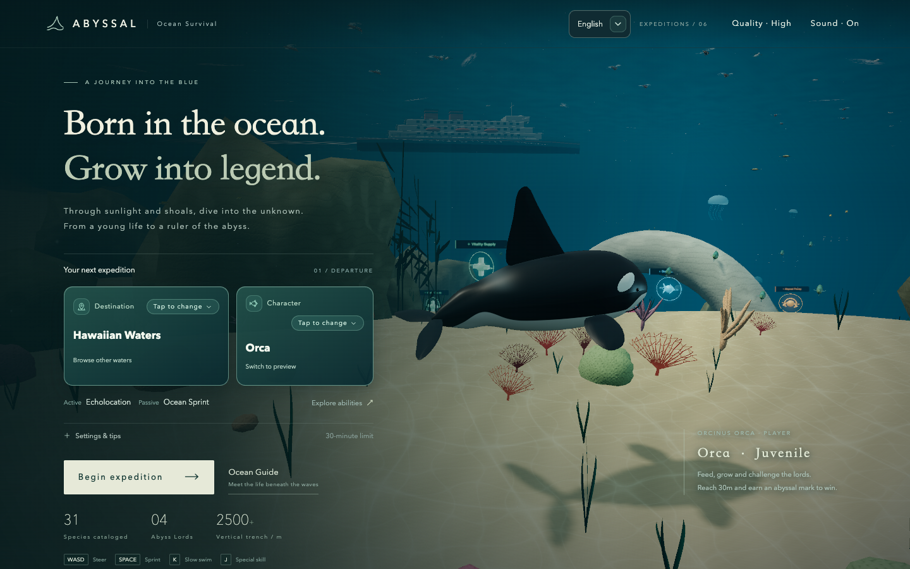

# ABYSSAL

A third-person ocean survival game for the browser. Choose an Orca or Giant Squid and swim from bright coral shallows into volcanic depths: feed, grow, escape hunters, and challenge the giants below.

**[Play the published game](https://stanatny.github.io/abyssal/)** · [GitHub repository](https://github.com/stanatny/abyssal)

Version: **v0.6.13**. GitHub Actions deploys `main` to the play URL above. This update improves the food supply and survival progression, reduces reward density, and replaces home-screen dropdowns with clear in-game selection panels.

Ordinary population is now 285, with additional distributed schools and deep-water prey. Hunger scales with size and depth, and successful lord bites restore some food. The shallows retain one starter pickup of each kind, with 18 further random rewards. Region and character cards open styled option panels; character choices show their role and abilities, and both mouse and keyboard focus behave consistently.

The current rules below include one starter pickup of each kind, Vitality Supply restoring 50 to all three vitals, and Ocean Current immediately refilling stamina before 30 seconds of free sprint. See the [shoreline and mine update](docs/feedback_v0_6_11.md) and [latest reward changes](docs/feedback_v0_6_12.md).



Play in a modern desktop or phone browser with WebGL 2 support—no account or download required. Select a character on the home screen and start an expedition. Music activates after the first interaction. Fish feeding uses short water-Foley intake, bite, and bubble tails, with three variants that avoid consecutive repetition. Adult male/female swimmers and divers use corresponding performed human recordings at their original pitch, gradually muffled later in the clip to suggest submersion. Prey-gathering transitions and blood clouds remain. Sound can be disabled at any time. Assets are CC0; see [audio sources](docs/audio_sources.md).

Starting an expedition smoothly rotates the home scene into the follow camera over about 1.65 seconds. The round timer and survival systems begin after control is handed over. You can pause and resume the transition; system reduced-motion preferences skip the camera travel.

## Languages

The game supports Simplified Chinese (`zh-CN`) and English (`en`) across menus, HUD, Ocean Guide, notifications, and results. Select a language at the top right of the home screen or in the pause panel. The first visit follows the browser language; an explicit choice is saved in local storage for later visits.

Implementation and copy-authoring guidance are in [localization](docs/localization.md). The [verification record](docs/verification.md) documents the bilingual update, including 245 unit tests, 28 gameplay browser checks, and 68 bilingual browser checks.

## Survive first, then rule the depths

Start as a **3-meter juvenile**, eat smaller creatures, and avoid larger hunters. **Reach 30 meters and defeat at least one Abyss Lord to win.** A round lasts at most 30 minutes of active play; paused time does not count.

- **Safe shallows:** Dense small-fish schools surround spawn. Hunters cannot enter or follow you in from offshore. Grow to about 4 meters before exploring the outer reef, where one hammerhead and one white shark patrol separate areas. The full hunter ecosystem lies farther down.
- **Food and survival:** Feeding replenishes hunger, repairs health first, then spends the remaining benefit on growth. Small prey yield progressively less nutrition and growth as you get larger. A full hunger bar lasts about 7.6 minutes for a 3-meter juvenile in the shallows; a 25-meter character has about 91 seconds in the deepest water. These are no-food budgets, not predicted lifetimes.
- **A gradual descent:** Hunger drain rises smoothly below 180 meters of displayed depth, reaching +30% at 2000 meters. Medium schools lead from the nursery edge toward the outer shelf; more octopuses, Dunkleosteus, and Ancient Giants fill the next feeding stages. Larger shallow-water schools stay within their own depth bands. Feed before a deep excursion or lord fight, and return shallower to recover. See the [survival balance notes](docs/survival_balance.md).
- **Sprint and escape:** Sprint drains stamina; releasing it allows recovery. Empty stamina does not directly damage health, but empty hunger does. Use reefs, rock columns, and hulls to break pursuit. Solid terrain cannot be crossed directly.
- **Surface and deep water:** Build momentum by sprinting underwater, then cross upward through the surface to breach and catch gulls. Ruins, volcanoes, submarines, and spherical contact mines await below.
- **Lord battles:** Two lords appear randomly each round. You must reach 25 meters to damage them, attack inward from a flank, leave contact, and approach again. At least five effective attacks are required; they cannot be swallowed whole. Each damaging bite restores up to 8 hunger (capped at 100), without healing or growth; defeat rewards are separate.
- **Find the nursery again:** Persistent radar shows location, heading, shallow/deep zones, and the direction of spawn. Pursuit and lord encounters change the music, while ability warnings signal danger.

## Choose your character

Each character has one active and one automatic passive ability. Both active abilities begin a **60-second cooldown on activation**.

| Character   | Active                                                                                                                                                                            | Passive                                                                                      |
| ----------- | --------------------------------------------------------------------------------------------------------------------------------------------------------------------------------- | -------------------------------------------------------------------------------------------- |
| Orca        | **Echolocation:** Detect nearby creatures for 20 seconds. Radar shows echoes; forward labels reveal creatures through fog or obstacles, including length and feeding eligibility. | **Ocean Sprint:** Sprint speed is 30% above the character base value.                        |
| Giant Squid | **Ink Jet:** Underwater ink disorients nearby pursuing hunters and engaged lords, stopping them for 10 seconds, while the squid briefly jets along its activation heading.        | **Flexible Turning:** Faster yaw and pitch when not sprinting make direction changes easier. |

Sonar labels appear only ahead; turning reveals other creatures. Schools share labels to avoid screen clutter. Terrain and hulls block the squid's jet, and ink does not grant invulnerability.

Orca and Giant Squid share juvenile feeding eligibility and close-contact tolerance, including contact with small fish crossed during sprint. Orca propels itself through vertical stalk/fluke motion with pectoral-assisted turning. Squid defaults to mantle-tip-leading swimming with trailing arms, using fin waves, mantle contraction, and segmented arms; it streamlines during sprint and gathers its arms when feeding. Squid capture occurs in the visible arm region, and swallowing draws prey toward each character's actual mouth. Motion follows actual speed and swimming state. This is the game's default posture; real Giant Squid can move in both directions. See the source qualifications in the [v0.6.10 record](docs/feedback_v0_6_10.md).

## Controls

The character continually swims along its heading. Releasing keys or joystick preserves that heading rather than automatically leveling. Both characters can pitch up/down to 85° underwater. Ordinary swimming at the surface eases upward pitch to about 20°; legitimate momentum-driven breaching is unaffected. A pitch gauge sits beside the radar. Eligible contact automatically feeds or attacks; **there is no bite key**.

| Action                         | Desktop keyboard             | Phone touch                                             |
| ------------------------------ | ---------------------------- | ------------------------------------------------------- |
| Rise / dive, turn left / right | W / S, A / D                 | Left joystick                                           |
| Sprint                         | Hold Space                   | Hold Sprint                                             |
| Character active ability       | J                            | Tap the ability button; countdown shown during cooldown |
| Slow swim                      | Hold K                       | —                                                       |
| Pause / resume                 | Esc, P, or on-screen control | Pause button                                            |

Desktop swimming is keyboard-only; the mouse operates menus and the guide. The phone game area prevents long-press text selection and menus, while guide search remains editable. **Invert vertical controls** under the home screen's expedition settings makes W / joystick up dive and S / joystick down rise, preserving the choice across refreshes. Sound, quality, and ordinary creature labels have interface settings. Marker preferences live on the home screen; sonar temporarily forces forward detection labels.

## What's in the ocean?

The **Hawaii fantasy region** is currently open. Mariana Trench, Bermuda Triangle, and Atlantis Ruins are unavailable entrances for future regions.

| Category             | Current content                                                                                                                                              |
| -------------------- | ------------------------------------------------------------------------------------------------------------------------------------------------------------ |
| Shallows and schools | 13 ordinary prey types, including schools, flying fish, green sea turtle, ocean sunfish, and slow longhorn cowfish, bumphead parrotfish, and humphead wrasse |
| Ocean Predators      | Deep-sea anglerfish, hammerhead, Giant Pacific Octopus, great white shark, and sperm whale, with distinct sizes, depth ranges, and behavior                  |
| Ancient Giants       | Dunkleosteus, pliosaur, plesiosaur, mosasaur, Basilosaurus, and megalodon                                                                                    |
| Abyss Lords          | Kraken, an original Maya-inspired monster, Three-Headed Hydra, and Leviathan, using vortices, pulses, repeated breath attacks, and high-speed charges        |
| Human activity       | Adult swimmers, adult divers, submarines, and horned contact mines; submarines require three separate rams meeting size and speed thresholds                 |

The home-screen **Ocean Guide** contains **35 character, creature, and human-activity entries**, including **24 ordinary marine species**, plus a separate rewards section. It follows system light/dark appearance and responds to changes while open. Swimmer/diver details offer male/female model previews. **Giant Squid is playable only; the wild cephalopod is the Giant Pacific Octopus.**

This region mixes modern animals, Ancient Giants, and fantasy lords; it is not a reconstruction of real Hawaiian ecology. Lengths, depths, and speeds use game scale. Body length, wingspan, and tentacle length do not imply equivalent mass. See [ecological references and design choices](docs/ecology_sources_v0_5.md).

## Ocean rewards

The guide explains rewards, and active effects appear in the HUD after pickup. Repeating a timed reward refreshes its duration rather than stacking it. The shallows retain one pickup of each type; 18 further rewards are placed randomly each round, for 21 total. Collected rewards respawn in their current-round positions after 45 seconds.

| Reward          | Appearance         | Effect                                                                                                                                                                                                              |
| --------------- | ------------------ | ------------------------------------------------------------------------------------------------------------------------------------------------------------------------------------------------------------------- |
| Vitality Supply | Green cross        | Immediately restores 50 health, 50 stamina, and 50 hunger, each capped at 100, and clears exhaustion.                                                                                                               |
| Ocean Current   | Blue double arrows | Immediately refills stamina and clears exhaustion. Sprint costs no stamina for 30 seconds.                                                                                                                          |
| Abyssal Frenzy  | Orange fangs       | For 20 seconds, close-range feeding expands and nearby edible underwater prey are drawn toward your mouth. It does not enlarge your body or let you eat larger creatures; normal feeding still heals and grows you. |

Frenzy changes only capture reach and suction. It does not alter feeding eligibility, body size, or growth rewards. Rocks and hulls block suction; creatures at least as long as you, lords, submarines, and mines cannot be pulled in. Collecting it again refreshes its 20-second duration, and growth from normal meals remains after it expires.

## Local development

New or redrawn creatures, humans, environments, audio, and effects must meet the [asset quality standard](docs/asset_quality_standard.md), using current refined counterparts as the minimum reference. Below-standard work remains an explicitly labeled prototype rather than shipping as a new category. Start with [AGENTS.md](AGENTS.md).

The project uses JavaScript, Three.js, and Vite. Models, animation, music, and most event effects are procedural; adult screams use bundled CC0 human recordings. Node.js 22.12+ and a WebGL 2 browser are recommended.

```bash
npm ci
npm run dev
```

The default development URL is `http://127.0.0.1:5178`. Common commands:

```bash
npm test          # Game rules and implementation unit tests
npm run check     # Source and documentation formatting
npm run build     # Build the static site into dist/
npm run preview   # Preview the built artifacts locally
```

Keep the development server running and execute `npm run test:browser` in another terminal for key browser flows. Browser scripts use locally installed Google Chrome; `ABYSSAL_DEV_URL` overrides the development URL. Run `node scripts/verify_i18n.mjs` for bilingual browser coverage; consult the [verification record](docs/verification.md) for execution results and limits. Targeted entry points, results, and limits are documented there. Screenshots, logs, and listening files go to Git-ignored `.local/`.

Project documentation is maintained in English. Existing Chinese source comments remain; new player-facing copy is maintained through `src/i18n.js` and `src/locales/` so both supported languages stay covered.

Pushing to `main` runs installation, unit tests, formatting, and build through [GitHub Actions](.github/workflows/pages.yml), then publishes `dist/` to [GitHub Pages](https://stanatny.github.io/abyssal/). Vite uses relative resource paths for repository-subpath deployment.

## Project status and next steps

The v0.6.10 foundation consolidated early playtest feedback: redesigned home, guide, HUD, ocean environment, and creatures; safe juvenile shallows and slow prey; free pitch, surface posture, inverted controls, and a nursery reward. Humans have male/female models and performed voice recordings, with corrected freestyle strokes. Fish feeding uses three water-Foley variants. See the [visual-upgrade record](docs/visual_upgrade_v0_6.md), [nursery changes](docs/feedback_v0_6_2.md), and [audio sources](docs/audio_sources.md).

Both characters have independent cruise, sprint, turn, and feeding motion. Capture points follow visible models, and continuous contact recovers small fish crossed at high speed. Giant Squid defaults to mantle-tip-leading, arms-trailing motion, separately aligning arm-region capture and actual mouth intake. Real animals can move bidirectionally; see [v0.6.10 decisions](docs/feedback_v0_6_10.md).

**Historical v0.6.10 pre-release checks:** 239 unit tests, 11 feeding/motion checks, and 6 desktop/phone-size public-preview groups passed, along with formatting/build. These historical counts are separate from the bilingual update checks above. Full scope and limitations are in [verification](docs/verification.md). Formal deployment status is available in [GitHub Actions](https://github.com/stanatny/abyssal/actions/workflows/pages.yml). “Uncommitted/unpushed” statements in older feedback records preserve their status at the time.

This is a single-player static web game: no accounts, online multiplayer, or cloud saves, and the current round is not saved. Browser local storage retains best length and preferences. Procedural models and ecology remain simplified. Natural full-round pacing, real-phone handling, and low-end performance need continued tuning; browser viewport emulation is not real-device acceptance.

- [v0.5 gameplay, characters, and combat](docs/feedback_v0_5.md)
- [v0.5.1 playable squid and wild octopus](docs/feedback_v0_5_1.md)
- [Actual verification records](docs/verification.md)
- [Next steps](docs/next_steps.md)
