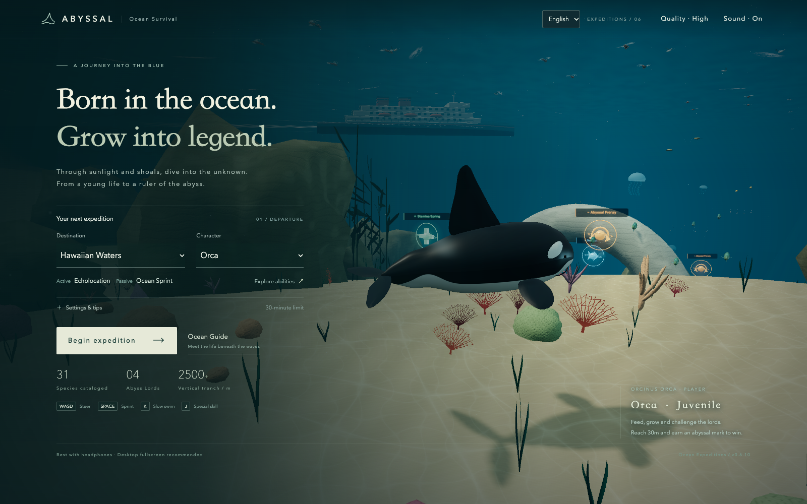

# ABYSSAL · 深渊猎游

一款第三人称深海生存网页游戏。选择虎鲸或大王乌贼，从明亮的珊瑚浅滩游向火山深渊：捕食、成长、逃离猎手，再挑战盘踞深海的巨兽。

**[正式试玩](https://stanatny.github.io/abyssal/)** · [GitHub 仓库](https://github.com/stanatny/abyssal)

当前版本：**v0.6.10**。`main` 分支通过 GitHub Actions 自动部署至上面的正式试玩地址；本轮整合视觉重绘、育幼浅滩、音效、自由游动与双角色捕食动作。



使用支持 WebGL 2 的现代桌面或手机浏览器即可游玩，无需注册或下载。进入首页选择角色，点击「开启远征」开始；音乐会在首次交互后启用。捕食小鱼播放由水声拟音制作的短促吸入、咬合与气泡尾声，三个变体避免相邻重复；成年男女游泳者及潜水员分别使用对应的真人表演录音，保留原音高，后半程逐渐闷化以表现入水，同时保留吞食过渡与血雾。可随时关闭声音。素材采用 CC0，详见 [音频来源](docs/audio_sources.md)。

## 先活下来，再成为深海主宰

从 **3 米的幼年角色**开始，捕食比自己小的生物，躲避更大的猎手。**长到 30 米，并至少击败一位深渊领主，即可获胜。** 单局上限为 30 分钟有效游玩时间，暂停不计时。

- **安全浅滩**：出生海域有密集小鱼群，猎手不会进入，也不能从外海一路追进来。先成长到约 4 米，再主动探索外礁；外礁只安排一只锤头鲨和一只白鲨分区巡游，更深处才是完整猎手生态。
- **进食与生存**：吃鱼会补充饱食，优先修复生命，再将剩余收益用于成长。体型越大，小鱼越难满足需求，需要向更深处探索。
- **冲刺与逃脱**：冲刺消耗体力，松开后恢复。体力耗尽不会直接扣血，饱食耗尽会。利用礁石、岩柱和船体绕开追击，实体地形无法直接穿过。
- **水面与深海**：先在水下持续冲刺蓄势，再向上破水，可以跃出海面捕食海鸥；深处有遗迹、火山、潜艇和接触后爆炸的鱼雷。
- **领主战斗**：每局随机出现两位领主。通常达到 24 米后才能伤害它们，需要从侧翼朝内进攻、离开后再次接近，至少五次有效攻击；无法直接一口吞掉。
- **找回浅滩**：常驻雷达显示位置、航向、深浅区和出生点方向。追击与领主战会改变配乐，技能预警也会提示危险。

## 选择你的角色

每个角色拥有一个主动技能和一个自动生效的被动。两种主动技能均从释放时开始计算 **60 秒冷却**。

| 角色     | 主动技能                                                                                                     | 被动技能                                                   |
| -------- | ------------------------------------------------------------------------------------------------------------ | ---------------------------------------------------------- |
| 虎鲸     | **回声定位**：探测周围生物 20 秒，雷达显示回声；前方标记揭示雾中或障碍物后的生物、体长及捕食资格             | **海洋疾驰**：冲刺速度比角色基础值提高 30%                 |
| 大王乌贼 | **墨幕喷射**：在水下喷墨，使附近正在追击的猎手和交战领主迷失、停留 10 秒，同时向释放时的前方快速喷射一段距离 | **柔躯回旋**：未冲刺时左右及俯仰转向更快，便于灵活改变游向 |

声呐只在画面前方显示目标，转向后逐步揭示其他生物；同类鱼群会合并标记，避免遮满屏幕。乌贼的喷射会被地形和船体阻挡，墨幕并不提供无敌状态。

虎鲸与大王乌贼采用相同的幼年捕食资格和近身容错，冲刺途中接触小鱼也会计入判定。虎鲸通过尾柄和尾鳍上下推进，胸鳍辅助转向；乌贼默认外套膜尖端领先、腕足拖后，通过鳍波、外套膜收缩和分节腕足表现游动，冲刺时收束、捕食时收腕。乌贼接触捕食位于可见腕区，吞食过渡将猎物收拢到各自嘴部；动作随实际速度和游动状态变化。这是游戏的默认游姿，真实大王乌贼具备双向运动能力，资料边界见 [本轮记录](docs/feedback_v0_6_10.md)。

## 操作

角色会沿当前朝向持续游动；松开方向键或摇杆后保持朝向，不会自动回正。两种角色在水下均可上仰或下俯至 85°；普通浮游到海面后，上仰会平滑收拢至约 20°，真实蓄势破水不受影响。雷达旁显示俯仰刻度。碰到符合条件的目标会自动捕食或攻击，**没有咬击按键**。

| 操作                  | 桌面键盘          | 手机触屏                       |
| --------------------- | ----------------- | ------------------------------ |
| 上浮 / 下潜、左右转向 | W / S、A / D      | 左侧摇杆                       |
| 冲刺                  | 按住空格          | 按住冲刺按钮                   |
| 角色主动技能          | J                 | 点击技能按钮，冷却时显示倒计时 |
| 慢游                  | 按住 K            | —                              |
| 暂停 / 继续           | Esc、P 或界面按钮 | 暂停按钮                       |

桌面游泳使用纯键盘，鼠标可操作菜单和图鉴。手机游戏区禁用长按选字和菜单，图鉴搜索框仍可正常输入。首页“远征设置与说明”可开启**反转上下方向**：W / 摇杆向上改为下潜，S / 摇杆向下改为上浮，刷新后保留选择。声音、画质及常规生物标记可在界面中设置；标记偏好位于游戏首页，声呐期间会临时强制显示前方探测目标。

## 海洋里有什么

目前开放 **夏威夷幻想海域**。马里亚纳海沟、百慕大三角和亚特兰蒂斯遗迹是尚未开放的后续海域入口。

| 分类       | 本期内容                                                                             |
| ---------- | ------------------------------------------------------------------------------------ |
| 浅滩与鱼群 | 13 种普通猎物，包括鱼群、飞鱼、绿海龟、翻车鱼，以及缓游的长角箱鲀、隆头鹦嘴鱼和苏眉  |
| 海洋霸主   | 深海鮟鱇、锤头鲨、北太平洋巨型章鱼、大白鲨、抹香鲸；各有体型、水层和行为差异         |
| 远古巨兽   | 邓氏鱼、上龙、蛇颈龙、沧龙、龙王鲸、巨齿鲨                                           |
| 深渊领主   | 克拉肯、玛雅灵感原创巨兽、三头海德拉、利维坦，分别带来漩涡、脉冲、连续吐息和高速冲撞 |
| 人类活动   | 成年游泳者、成年潜水员、潜艇与鱼雷；潜艇需要满足体型和速度条件，独立冲撞三次才能破坏 |

首页「海洋图鉴」有 **35 条角色、生物与人类活动记录**，其中普通海洋生物为 **24 种**，并另设奖励模块。图鉴会跟随系统浅色或深色设置，并支持打开时实时切换；游泳者与潜水员详情可切换男／女模型预览。**大王乌贼仅作为可选角色，野外头足类由北太平洋巨型章鱼担任。**

这是一片混合现代生物、远古巨兽与幻想领主的游戏海域，并非真实夏威夷生态复刻。体长、水深和速度采用游戏尺度；不同动物的体长、翼展或触腕长度也不等于相同体量。真实资料与设计取舍见 [生态资料与来源](docs/ecology_sources_v0_5.md)。

## 海洋奖励

奖励用途可在图鉴中查看，拾取后游戏内显示生效状态。同类限时奖励再次拾取会刷新时长，不累加。出生浅滩正前方略偏右有固定狂食点，拾取后45秒原地刷新。

| 奖励     | 外观       | 效果                                                                                 |
| -------- | ---------- | ------------------------------------------------------------------------------------ |
| 体力泉   | 绿色十字   | 体力立即回满，解除疲惫                                                               |
| 洋流之息 | 蓝色双箭头 | 30 秒内冲刺不耗体力                                                                  |
| 深渊狂食 | 橙色獠牙   | 30 秒内可吞食自身 1.6 倍体长以内的普通猎物；领主攻击门槛降至 21 米，仍需多次侧翼进攻 |

## 本地开发

新增或重绘生物、人物、环境、声音和特效须遵循 [资产质量标准](docs/asset_quality_standard.md)，以当前精修同类内容为最低参照；未达标内容仅作开发原型，不作为正式新类别上线。开发入口规则见 [AGENTS.md](AGENTS.md)。

项目使用 JavaScript、Three.js 和 Vite，模型、动画、配乐与多数事件音效由程序生成，成年人物惨叫使用随应用打包的 CC0 真人录音。建议使用 Node.js 22.12+，并准备支持 WebGL 2 的浏览器。

```bash
npm ci
npm run dev
```

开发地址默认是 `http://127.0.0.1:5178`。常用命令：

```bash
npm test          # 游戏规则单元测试
npm run check     # 代码与文档格式检查
npm run build     # 构建静态网页至 dist/
npm run preview   # 本地预览构建产物
```

保持开发服务器运行，在另一终端执行 `npm run test:browser` 验证浏览器关键流程。浏览器脚本使用本机 Google Chrome，可通过 `ABYSSAL_DEV_URL` 覆盖开发地址；专项验证入口、结果与边界见 [验证记录](docs/verification.md)。生成的截图、日志和试听文件保存在不进入版本控制的 `.local/`。

推送到 `main` 后，[GitHub Actions](.github/workflows/pages.yml) 会执行安装、单元测试、格式检查及构建，并将 `dist/` 发布到 [GitHub Pages](https://stanatny.github.io/abyssal/)。Vite 使用相对资源路径，支持仓库子路径部署。

## 项目状态与后续

v0.6.10 汇总了早期试玩反馈：重绘首页、图鉴、HUD、海洋环境与各类生物，补充幼年安全浅滩和缓游猎物，调整自由俯仰、水面姿态、反转上下设置与浅滩奖励。人物采用男女模型及真人表演音效，修正自由泳动作；鱼类吞食使用三个水声拟音变体。详见 [视觉升级记录](docs/visual_upgrade_v0_6.md)、[育幼浅滩](docs/feedback_v0_6_2.md)和[音频来源](docs/audio_sources.md)。

两角色的巡游、冲刺、转向与进食采用独立动作，捕食点跟随可见模型，高速穿过小鱼时通过连续接触判定补获。大王乌贼采用外套膜尖端领先、腕足拖后的默认游姿，腕区接触与实际嘴部吞入分别对齐；真实动物具备双向运动能力，取舍见 [v0.6.10 记录](docs/feedback_v0_6_10.md)。

发布前239项单元测试、11项捕食与动作专项、6组桌面／手机尺寸公开预览检查通过，格式检查及构建通过；完整执行范围与局限见 [验证记录](docs/verification.md)。正式部署结果可查看 [GitHub Actions](https://github.com/stanatny/abyssal/actions/workflows/pages.yml)。各轮反馈文档中的“未提交／未推送”描述保留其当时状态。

目前为单机静态网页：无账号、联网对战或云存档，当前局进度不会保存；浏览器本地记录最佳体长和标记偏好。程序化模型与生态规则仍有简化，完整自然游玩节奏、真实手机手感及低性能设备表现还需持续调优，浏览器模拟尺寸测试不代表真机验收。

- [v0.5 玩法、角色与战斗规则](docs/feedback_v0_5.md)
- [v0.5.1 可选乌贼与野生章鱼调整](docs/feedback_v0_5_1.md)
- [实际验证记录](docs/verification.md)
- [后续计划](docs/next_steps.md)
